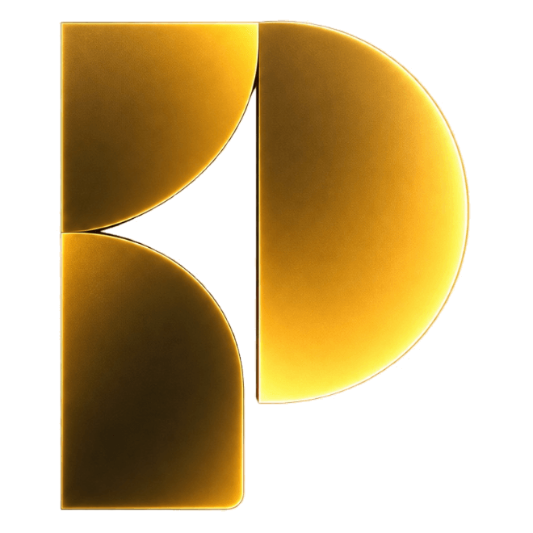

<div align="center">



# PACT — Personal Operating System

**A System for Keeping Promises to Yourself.**  
*Turn Intent Into Discipline.*

[](LICENSE)
[](https://nextjs.org/)
[](https://react.dev/)
[](https://www.typescriptlang.org/)
[](https://tailwindcss.com/)
[](https://supabase.com/)

<br />

**PACT** is an open-source **Personal Operating System (OS)** engineered to bridge the critical gap between intention and execution. Rather than acting as a passive to-do list, PACT provides an active governance system unifying time-blocked planning, strategic goals, deep work focus, financial cash flow, and unbreakable accountability contracts.

[Quick Start](#-quick-start) · [Core Features](#-core-features) · [Contributing](#-contributing) · [Architecture](#-architecture) · [Documentation](#-documentation)

</div>

---

## 🧭 Why PACT Exists

Most productivity software suffers from **passive accumulation**: tasks, goals, and habits are created with high enthusiasm, but abandoned without consequence when friction occurs.

**Intent is easy. Execution is difficult.**

PACT is engineered around four foundational principles:
1. **Unbreakable Accountability**: Commitments are tied to explicit deadlines, verified proofs, and enforceable consequences.
2. **Temporal Truth**: Time-blocked planning with bi-directional Google Calendar synchronization ensures realistic daily capacity.
3. **Objective Proof Verification**: Automated proof-of-work connectors validate engineering and problem-solving activity via external platforms (GitHub, LeetCode, Codeforces).
4. **Holistic Governance**: Single unified operational system for tasks, strategic goals, scoped projects, recurring routines, deep work focus sessions, and integer-cents financial cash flow.

---

## ✨ Core Features

PACT is composed of 14 integrated systems operating under a cohesive, responsive interface:

| System | Capabilities | Status |
| :--- | :--- | :--- |
| **Command Center** | Daily situational dashboard with a photorealistic 3D celestial hero, focus metrics, and universal search (`Cmd+K`). | Available |
| **Tasks & Backlog** | Priority matrix, estimated duration, scheduled times, deadline tracking, and multi-select bulk operations. | Available |
| **Planner** | Day, Week, and Month time-blocking with drag-and-drop scheduling, timezone boundary enforcement, and calendar conflict markers. | Available |
| **Goals & Milestones** | Strategic long-term intentional targets with progress tracking, associated projects, and target deadlines. | Available |
| **Projects** | Scoped deliverable containers grouping associated tasks, tracking phase completion rates and deadlines. | Available |
| **Accountability Engine** | Enforceable contracts binding tasks to confidential consequences, waiver quotas (max 2/week), and resolution workflows. | Available |
| **Deep Work Focus Timer** | Configurable interval focus engine (Pomodoro/Flow), synthesized Web Audio acoustic chimes, and deep work logs. | Available |
| **Habits & Routines** | Daily routine templates (Morning Kickoff, Evening Wind-down), completion tracking, and streak engines. | Available |
| **Finance & Cash Flow** | Integer-cents transaction ledger (`amount_cents`), recurring expense models, net cash calculations, and budget ceiling alerts. | Available |
| **Weekly Review** | 5-step guided Sunday planning ritual: Celebrate Wins, Review Metrics, Process Incompletes, Calibrate Goals, Commit Next Week. | Available |
| **Analytics & Scoring** | Quantitative follow-through scoring, task completion velocity, weekly trend comparisons, and historical breakdowns. | Available |
| **Integrations & Proofs** | Connectors for Google Calendar (OAuth bi-directional sync), GitHub (commits/PRs), LeetCode, and Codeforces. | Available |
| **Autonomous Sweeper** | Autonomous cron engine (`/api/cron/sweep-deadlines`) evaluating grace periods, expiring overdue tasks, and escalating consequences. | Available |
| **Settings & Portability** | User profile configuration, timezone management, notification channels, and complete RFC 4180 ZIP/JSON/CSV account export. | Available |

---

## 🎨 Visual Identity & Design Philosophy

PACT features a distinctive luxury visual language designed for calm, executive focus:
- **Obsidian Canvas Foundation**: Deepest OLED Obsidian (`#050505`, `#070707`, `#090909`) with zero light glare.
- **Solid Luxury Surfaces**: Rich, disciplined card surfaces (`#0C0C0F`, `#101012`) with ultra-fine specular hairline borders (`rgba(255, 255, 255, 0.06)`).
- **Restrained PACT Gold**: Warm gold accents (`#D4AF37`, `#E6C34A`) applied with strict surgical intent for active markers, progress tracks, and specular crescent rims.
- **3D Celestial Planetary Hero**: Photorealistic 3D planet sphere with volumetric SVG radial lighting, Rayleigh atmospheric back-scatter, and razor-thin gold crescent highlight.

> For complete guidelines, typography scales, and token values, see the [Design System Specification](docs/DESIGN_SYSTEM.md).

---

## 🛠️ Technology Stack

PACT is built with modern, production-grade web technologies:

- **Frontend Core**: [Next.js 16](https://nextjs.org/) (App Router, React Server Components, Server Actions) & [React 19](https://react.dev/)
- **Language**: [TypeScript 5](https://www.typescriptlang.org/) (Strict Mode)
- **Styling**: [Tailwind CSS v4](https://tailwindcss.com/) & Vanilla CSS Design Tokens
- **Motion & Icons**: [Framer Motion](https://www.framer.com/motion/) & [Lucide React](https://lucide.dev/)
- **Database & Auth**: [Supabase](https://supabase.com/) PostgreSQL with Row Level Security (RLS) & SSR Cookie Authentication (`@supabase/ssr`)
- **Validation**: [Zod](https://zod.dev/) Schemas for all Server Actions and API boundaries
- **Audio Engine**: Native Web Audio API synthesis (zero external audio assets required)

---

## 🏛️ Architecture

PACT enforces a strict database-first, server-authoritative architecture:

```
+-------------------------------------------------------------+
|                Client Layer (React 19 / UI)                 |
|  - Obsidian Theme Tokens    - 3D Celestial Planetary Hero   |
|  - Accessible Dialogs       - URL State Sync (useUrlState)  |
+-------------------------------------------------------------+
                               |
                 Server Actions & API Routes
                               |
+-------------------------------------------------------------+
|              Domain Business Logic (src/lib/)               |
|  - Accountability Engine     - Focus Session Engine         |
|  - Financial Arithmetic      - Habits & Streak Engine       |
|  - External Proof Sweeper    - Analytics Matrix             |
+-------------------------------------------------------------+
                               |
                 Supabase SSR Database Client
                               |
+-------------------------------------------------------------+
|                 Database Layer (PostgreSQL)                 |
|  - Row Level Security (RLS) on 100% of User Tables          |
|  - Confidential Consequence Masking                         |
|  - Autonomous pg_cron Deadline Sweeper Engine               |
+-------------------------------------------------------------+
```

> For deep architectural details, see the [Architecture Guide](docs/ARCHITECTURE.md) and [Data Model Specification](docs/DATA_MODEL.md).

---

## 🚀 Quick Start

### Prerequisites
- **Node.js**: `v20.x` or `v22.x` (LTS recommended)
- **Package Manager**: `npm` (v10+)
- **Git**: Installed and configured

### Local Setup

```bash
# 1. Clone your fork or the repository
git clone https://github.com/TheVicky1/Pact_OS.git
cd Pact_OS

# 2. Install dependencies
npm install

# 3. Configure local environment variables
cp .env.example .env.local

# 4. Start local development server
npm run dev
```

Open [http://localhost:3000](http://localhost:3000) in your browser to start using PACT.

### Verification & Testing

Run the local validation suite before committing changes:

```bash
# Run ESLint check
npm run lint

# Run TypeScript type check
npx tsc --noEmit

# Run 34-suite domain and security test matrix
node scratch/run-tests.mjs

# Run pre-commit secret scanner
node scratch/secret-scan.mjs

# Run production build verification
npm run build
```

> 💡 **Having setup issues?** Consult our [**Troubleshooting Guide**](docs/TROUBLESHOOTING.md) for solutions to common port, Node.js, and environment issues.

---

## 📂 Project Structure

```
Pact_OS/
├── src/
│   ├── app/                   # Next.js 16 App Router pages & API routes
│   │   ├── (auth)/            # Unified landing & authentication screens
│   │   ├── app/               # Authenticated Core OS routes (planner, goals, etc.)
│   │   └── api/               # Cron sweeper & data export API endpoints
│   ├── components/            # Reusable UI primitives (buttons, modals, cards)
│   ├── features/              # Feature modules (dashboard, calendar, habits, review)
│   ├── hooks/                 # Custom React hooks (useUrlState, useSelection)
│   ├── lib/                   # Core domain business logic and engines
│   └── types/                 # TypeScript domain contracts
├── supabase/                  # PostgreSQL schema migrations and RLS policies
├── tests/                     # Automated domain and security test suites
├── docs/                      # Comprehensive technical & product documentation
└── scratch/                   # Test runner and secret scanning utilities
```

---

## 🌱 Contributing

Contributions are warmly welcomed! We believe in building a transparent, supportive, and beginner-friendly open-source community.

> ### 🌱 New to Open Source?
> You do not need to be an expert to contribute. We value all contributions—whether fixing a typo in documentation, improving UI accessibility, adding unit tests, or reporting a bug.
>
> Start with our step-by-step [**Beginner's Contribution Guide**](docs/CONTRIBUTING-BEGINNERS.md) for a complete zero-to-PR walkthrough, or consult [**CONTRIBUTING.md**](CONTRIBUTING.md) for standard developer guidelines.

### Contribution Resources
- 🌱 [**Beginner's Guide**](docs/CONTRIBUTING-BEGINNERS.md) — Step-by-step walkthrough for first-time contributors.
- 📖 [**Contributing Guide**](CONTRIBUTING.md) — Workflow, code standards, and PR guidelines.
- 🏷️ [**Label Taxonomy**](docs/GITHUB_LABELS.md) — Official issue classification system and difficulty tiers.
- 🔧 [**Troubleshooting Guide**](docs/TROUBLESHOOTING.md) — Diagnostics for environment, build, and Git issues.
- 🤝 [**Code of Conduct**](CODE_OF_CONDUCT.md) — Community standards and participation guidelines.
- 💬 [**Support Guide**](SUPPORT.md) — Where to ask questions, report bugs, and propose features.
- 👥 [**Contributors**](CONTRIBUTORS.md) — Recognition of core maintainers and community contributors.
- 🔒 [**Security Policy**](SECURITY.md) — Responsible disclosure of security vulnerabilities.

---

## 🗺️ Product Roadmap

- [x] **14 Core Product Systems**: Complete domain model, UI, and Server Actions.
- [x] **Autonomous Deadline Sweeper**: Production cron sweeper with timing-safe authorization.
- [x] **External Proof-of-Work Connectors**: GitHub, LeetCode, and Codeforces verification.
- [x] **Open Source Foundation**: MIT License, Contributing Guide, Code of Conduct, and Security Policy.
- [ ] **Open Source Contributor Automation**: Issue templates, PR templates, and CI/CD pipelines. *(In Progress)*
- [ ] **Native Mobile Companion**: React Native / Expo application for on-the-go quick capture. *(Planned)*
- [ ] **Biometric WebAuthn Passkeys**: Passwordless biometric authentication. *(Planned)*

> For the full product roadmap, see [docs/ROADMAP.md](docs/ROADMAP.md).

---

## 📚 Documentation Directory

Comprehensive technical specifications, system architectures, and operational runbooks are maintained in [`docs/`](docs/README.md):

| Document | Purpose |
| :--- | :--- |
| 🌱 [**Beginner Contributing**](docs/CONTRIBUTING-BEGINNERS.md) | Step-by-step zero-to-PR guide for first-time contributors |
| 🏷️ [**GitHub Labels**](docs/GITHUB_LABELS.md) | Canonical issue classification, difficulty levels & composition |
| 🔧 [**Troubleshooting**](docs/TROUBLESHOOTING.md) | Practical fixes for common setup, build, and Git roadblocks |
| 🌟 [**Master Documentation**](docs/PACT_MASTER_DOCUMENTATION.md) | Central comprehensive technical and product reference |
| 📖 [**Product Vision**](docs/PRODUCT.md) | Vision, dual taglines, product philosophy, and core principles |
| 📋 [**Feature Inventory**](docs/FEATURES.md) | Authoritative inventory of all 14 core product modules |
| 🏗️ [**Architecture**](docs/ARCHITECTURE.md) | Next.js 16 App Router architecture, server boundaries, and data flow |
| 🗄️ [**Data Model**](docs/DATA_MODEL.md) | Relational entity schemas, constraints, indexes, and RLS policies |
| 🔌 [**Integrations**](docs/INTEGRATIONS.md) | Google Calendar, GitHub, LeetCode, and Codeforces connectors |
| 🔒 [**Security Architecture**](docs/SECURITY.md) | 28-point security matrix, zero-trust validation, and secret sanitization |
| 🛡️ [**Threat Model**](docs/THREAT_MODEL.md) | Threat actor matrix, attack surfaces, and defense-in-depth mitigations |
| 💻 [**Developer Guide**](docs/DEVELOPMENT.md) | Local environment setup, database migrations, and development commands |
| 🧪 [**Testing Strategy**](docs/TESTING.md) | Automated test matrix and verification runbooks |
| 🌿 [**Git Workflow**](docs/GIT_WORKFLOW.md) | Conventional Commits, branch hygiene, and pre-commit safety rules |
| 🗺️ [**Product Roadmap**](docs/ROADMAP.md) | Verified implementation status and future planned milestones |
| 🎨 [**Design System**](docs/DESIGN_SYSTEM.md) | Luxury Obsidian & Gold palette, 3D celestial planetary hero, and design tokens |
| 🔄 [**User Flows**](docs/USER_FLOWS.md) | Domain hierarchy flow, daily planning, and consequence lifecycle |
| 🚀 [**Deployment Runbook**](docs/PRODUCTION_DEPLOYMENT_RUNBOOK.md) | Production cloud deployment guide and environment configuration |

---

## 📄 License

PACT is open-source software licensed under the [MIT License](LICENSE).
