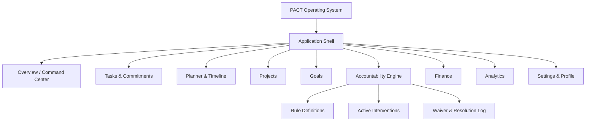
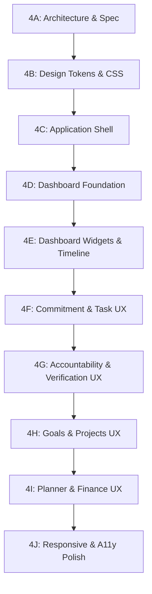

# PACT — PHASE 4: ACCOUNTABILITY UX ARCHITECTURE & COMPLETE UI/UX DESIGN SPECIFICATION

> **Milestone**: Phase 4A — UX Architecture & Comprehensive UI/UX Design Specification  
> **Status**: AUTHORITATIVE / FROZEN SPECIFICATION  
> **Date**: September 2026  
> **Product Name**: PACT (Personal Operating System)  
> **Approved Taglines**: *"Turn Intent Into Discipline"* / *"A System for Keeping Promises to Yourself"*  
> **Authoritative Brand Mark**: Official PACT Gold P Monogram (`/brand/pact-logo.png`)  
> **Visual North Star**: Reference Design (Cinematic Glassmorphism, Dark Command Center, Ambient Warm Lighting)

---

## 1. Executive Summary & Core Architectural Principles

### 1.1 Dual Sources of Truth
Phase 4 bridges two strictly decoupled sources of truth:
1. **Product & Functional Source of Truth**:
   - The authoritative PACT domain engine, database schema, and security architecture established across Phases 1, 2, and 3.
   - The frozen Phase 3 accountability backend: immutable snapshots, deterministic multi-default rule resolution, atomic consequence activation on `mark_task_missed`, server-controlled verification sessions, multi-modal fulfillment RPCs, and ISO-week waiver quotas evaluated in the user's IANA timezone.
   - Server-enforced task lifecycle state machines (`pending` → `in_progress` → `completed` | `missed` → `archived`).
   - Zero tolerance for fake metrics, invented backend capabilities, or ungrounded psychological scoring.

2. **Visual & Aesthetic Source of Truth**:
   - The approved reference design (`media_1788900653447.png`) acting as the **Visual North Star**.
   - The official PACT Gold P Monogram (`media_1788887018548.png` / `/brand/pact-logo.png`).
   - A disciplined, executive aesthetic: near-black canvases (`#09090b`), elevated translucent glass surfaces (`rgba(18, 18, 23, 0.70)`), restrained warm gold accents (`#D4AF37`), subtle cinematic directional lighting, clean sans-serif typography, and generous negative space.

### 1.2 Non-Negotiable Product Constraints
- **Zero Gamification Noise**: No celebratory confetti storms, cartoon badges, streak-shame popups, or juvenile sound effects. PACT is an operating system for serious personal discipline.
- **Speed-First Commitment Flow**: The primary task creation path must be frictionless (< 5 seconds: Title → Deadline → Save). Accountability defaults attach automatically in the background without imposing configuration fatigue.
- **Accountability Confidentiality**: Sensitive consequence payloads and punitive details are strictly masked and never clutter ordinary task cards or overview screens prior to activation.
- **Calm, Serious Interventions**: When a commitment is missed, PACT does not insult or shame the user. It presents a calm, focused, inescapable intervention offering transparent options: immediate verification fulfillment or disciplined quota-governed waiver.
- **Grounded Metrics Only**: Every number, ratio, and chart displayed in the UI must directly derive from real database rows (`tasks`, `goals`, `projects`, `accountability_events`, `expenses`). If a metric cannot be calculated from existing or explicitly specified tables, it is strictly omitted or marked `[FUTURE]`.

---

## 2. Repository Forensic Audit & Current UI Inventory

### 2.1 Current Route & Surface Inventory

| Route | Current Implementation | Functional Status | Data Source | Proposed Phase 4 Evolution |
|---|---|---|---|---|
| `/` | Landing page with hero, value propositions, and auth entry links. | IMPLEMENTED | Static / Public | Refine typography, align with cinematic glassmorphism visual language. |
| `/login` | Email/password sign-in and Google OAuth button. | IMPLEMENTED | `signInAction`, Supabase Auth | Retain auth architecture; elevate glass card finish and micro-interactions. |
| `/register` | Email/password, full name, timezone select, and Google OAuth. | IMPLEMENTED | `signUpAction`, Supabase Auth | Retain fields and IANA timezone detection; align container with shell tokens. |
| `/auth/callback` | OAuth exchange handler with safe redirect validation. | IMPLEMENTED | Supabase Auth Exchange | Retain unchanged (backend route). |
| `/app` | Dashboard overview displaying user greeting, metric pills, active commitments, and recent goals/projects. | PARTIALLY IMPLEMENTED | `getUserProfile`, `getTasks`, `getGoals`, `getProjects` | **Major Phase 4 Redesign**: Transform into executive command center with Daily Focus hero, Timeline widget, and Focus card grid. |
| `/app/tasks` | Task commitment list with filter tabs (All, Pending, Completed, Missed), modal forms, and lifecycle actions. | IMPLEMENTED | `getTasks`, `createTaskAction`, `completeTaskAction`, `markTaskMissedAction` | Elevate task card density, integrate commitment status badges, implement rapid inline creation, and prepare accountability drawer trigger. |
| `/app/projects` | Project grid with color accents, linked goal tags, and delete/create modals. | IMPLEMENTED | `getProjects`, `createProjectAction` | Upgrade to glass cards with progress indicators and linked task drawer. |
| `/app/goals` | Long-term intentional goal cards with target dates and status toggles. | IMPLEMENTED | `getGoals`, `createGoalAction` | Enrich with linked project counts, commitment follow-through ratios, and horizon badges. |
| `/app/accountability` | *None (Backend only)* | PHASE 4 NEW | `consequence_definitions`, `task_accountability_commitments`, `accountability_events` | **New Phase 4 Route**: Rule definitions management, active intervention cockpit, and historical audit log. |
| `/app/planner` | *None (Placeholder in nav)* | PHASE 4 NEW | `tasks` (scheduled / time-blocked) | **New Phase 4 Route**: Interactive daily/weekly timeline aligning commitment deadlines with hours of the day. |
| `/app/finance` | *None (Schema ready)* | PHASE 4 NEW | `expenses`, `expense_categories` | **New Phase 4 Route**: Rapid expense logger, category breakdown, and monthly budget horizon. |
| `/app/analytics` | *None (Data in DB)* | PHASE 4 NEW | Aggregated queries over `tasks`, `goals`, `accountability_events` | **New Phase 4 Route**: Follow-through ratio, completion velocity, and waiver quota consumption. |
| `/app/settings` | Profile timezone display in header | PARTIALLY IMPLEMENTED | `profiles` | **New Phase 4 Route**: Profile details, timezone configuration, notification rules, and integration accounts. |

### 2.2 Component Reusability & Debt Assessment
- **Existing Strengths**:
  - `PactLogo` is already upgraded to the official Gold P Monogram asset (`/brand/pact-logo.png`) across header and auth pages.
  - Server actions in `features/tasks/actions.ts`, `features/goals/actions.ts`, and `features/projects/actions.ts` enforce strict server-side Zod validation and user ownership checks.
  - `src/lib/time.ts` provides battle-tested canonical UTC storage and IANA timezone display formatters (`formatInUserTimezone`, `parseDateInTimezone`, `getUserCurrentDayBounds`).
- **Required Refactorings**:
  - Global navigation in `app-header.tsx` currently uses standard Tailwind border/zinc styles; it must be transformed into the floating cinematic top navigation bar defined in the Visual North Star.
  - Modals (`task-form-modal.tsx`, `project-form-modal.tsx`, `goal-form-modal.tsx`) currently duplicate backdrop and framing logic; they must be unified under a shared `Dialog` primitive.
  - The dashboard overview (`overview-view.tsx`) uses a flat 4-column metric row; it will be restructured into the hierarchical layout of the Visual North Star.

---

## 3. Visual North Star Deconstruction & Design Analysis

Based on forensic analysis of the reference design (`media_1788900653447.png`):

```
┌──────────────────────────────────────────────────────────────────────────────────────────────────┐
│  [P]   Overview   Planner   Projects   Goals                       (🔔)  (Kate Schowalter ⌵)     │  <- TOP NAV
├──────────────────────────────────────────────────────────────────────────────────────────────────┤
│  YOUR DAILY PLAN                               [ Keep it going!  ]               + Add Widget    │
│  Stay on Track Today                           [ 1 task remaining]               [ Customize  ]  │  <- HERO
├──────────────────────────────────────────────────────────────────────────────────────────────────┤
│  [ 7 Oct ]  Your Daily Commitments  2/5 completed                                        (←) (→) │  <- BANNER
├──────────────────────────────────────────────────────────────────────────────────────────────────┤
│  ┌──────────────────────┐  ┌──────────────────────┐  ┌────────────────────────────────────────┐  │
│  │ Deep Work Time       │  │ Follow-Through Ratio │  │ Daily Execution Distribution           │  │  <- CARDS
│  │ 1h 25m    [Ambient]  │  │ 88%       [Amber]    │  │ ▇ ▇ ▅ █ ▇ ▅ █ ▇ (Peak: 11 am)          │  │
│  └──────────────────────┘  └──────────────────────┘  └────────────────────────────────────────┘  │
├──────────────────────────────────────────────────────────────────────────────────────────────────┤
│  Daily Timeline | 3 Commitments for today                                       + New Commitment │
│  8 AM      9 AM      10 AM      11 AM      12 PM      1 PM      2 PM      3 PM      4 PM     │  <- TIMELINE
│  [ ✏️ Plan Sprint  • Low ]                 [ 📄 Review Architecture • Urgent ]                    │
└──────────────────────────────────────────────────────────────────────────────────────────────────┘
```

### 3.1 Layout & Spatial Geometry
- **Canvas Framing**: The interface sits within a max-width container (`max-w-[1440px]`) centered with outer padding (`px-6 sm:px-10 py-8`).
- **Surface Layering**: 
  - Level 0 (Base Canvas): Near-black `#09090B`.
  - Level 1 (Primary Glass Panels): `rgba(18, 18, 23, 0.70)` with `backdrop-blur-xl` and `1px` border `rgba(255, 255, 255, 0.07)`.
  - Level 2 (Elevated Interactive Widgets): `rgba(26, 26, 34, 0.75)` with subtle drop shadows (`0 8px 32px rgba(0, 0, 0, 0.35)`).
  - Level 3 (Floating Controls / Overlays): `rgba(32, 32, 42, 0.90)` with crisp gold or light specular borders.

### 3.2 Navigation Architecture
- **Horizontal Flow**: Logo on far left, followed by clean text-based navigation items with generous tracking (`tracking-wide`).
- **Active State**: A crisp horizontal accent line directly beneath the active label (`bg-gradient-to-r from-transparent via-[#D4AF37] to-transparent h-[2px]`), paired with bright white typography (`text-zinc-100 font-medium`).
- **Right Utilities**: Notification bell with subtle unread indicator dot, accompanied by the user profile badge with avatar, name, and subtle chevron dropdown.

### 3.3 Hero & Daily Horizon
- **Eyebrow Header**: Upper-case or small subdued title (`text-xs font-semibold tracking-wider text-zinc-400 uppercase`).
- **Main Heading**: Editorial headline (`text-3xl sm:text-4xl font-semibold text-zinc-100 tracking-tight`).
- **Contextual Milestone Badge**: Compact glassy pill widget acknowledging daily momentum (e.g., *"All previous tasks fulfilled"*).
- **Secondary Action Group**: Action buttons styled in pill shapes (`rounded-full px-5 py-2 text-xs font-medium`).

### 3.4 Metric & Visual Card Triad
- **Visual Rhythm**: Three asymmetrical cards across a 12-column grid:
  - Card 1 (Span 3-4): Primary timer or ongoing focus tracker with a directional ambient spotlight.
  - Card 2 (Span 3-4): Critical ratio or highlight metric with a rich, textured warm amber back-glow.
  - Card 3 (Span 4-6): Quantitative distribution or hourly bar histogram displaying temporal patterns.

### 3.5 Timeline Representation
- Horizontal 24-hour / working-hour axis with clean tabular hour labels (`8 AM`, `9 AM`, `...`).
- Subtle vertical divider rules defining hourly grid columns.
- Commitment capsules rendered as horizontal pills positioned along the time continuum according to their `deadline_at` or time-block window.
- Capsule design: Left icon, clear commitment title, and right priority pill (`• Low Priority`, `• Urgent`, `• High`).

---

## 4. PACT Design Language & Visual System Tokens

### 4.1 Color System (Tailwind CSS v4 Token Architecture)

```css
@theme {
  /* Surface Foundations */
  --color-canvas-base: #09090b;
  --color-canvas-subtle: #0d0d12;
  --color-surface-card: rgba(18, 18, 23, 0.75);
  --color-surface-hover: rgba(26, 26, 34, 0.85);
  --color-surface-elevated: rgba(30, 30, 40, 0.90);
  --color-surface-glass: rgba(18, 18, 23, 0.60);

  /* Borders & Specular Lines */
  --color-border-subtle: rgba(255, 255, 255, 0.06);
  --color-border-medium: rgba(255, 255, 255, 0.12);
  --color-border-gold: rgba(212, 175, 55, 0.30);
  --color-border-gold-strong: rgba(212, 175, 55, 0.60);

  /* PACT Restrained Warm Gold Accent */
  --color-gold-400: #F5E0A3;
  --color-gold-500: #D4AF37;
  --color-gold-600: #AA820A;
  --color-gold-glow: rgba(212, 175, 55, 0.18);
  --color-gold-ambient: rgba(212, 175, 55, 0.08);

  /* Typography Colors */
  --color-text-primary: #F4F4F5;
  --color-text-secondary: #A1A1AA;
  --color-text-muted: #71717A;
  --color-text-gold: #E2C056;

  /* Authoritative Status Signals */
  --color-status-pending: #3B82F6;
  --color-status-progress: #F59E0B;
  --color-status-completed: #10B981;
  --color-status-missed: #EF4444;
  --color-status-waived: #8B5CF6;
  --color-status-archived: #52525B;
}
```

### 4.2 Typography Scale & Optical Hierarchy
- **Font Stack**: `Geist Sans` (Primary UI), `Geist Mono` (Timers, Timestamps, Quotas, Code).
- **Display 1**: `text-4xl font-bold tracking-tight text-zinc-100` (Hero headlines).
- **Heading 1**: `text-2xl font-semibold tracking-tight text-zinc-100` (Section titles).
- **Heading 2**: `text-lg font-semibold tracking-normal text-zinc-100` (Card titles).
- **Body Regular**: `text-sm font-normal text-zinc-300 leading-relaxed` (Descriptions).
- **Caption / Meta**: `text-xs font-medium text-zinc-400` (Timestamps, priority tags).
- **Numeric Display**: `font-mono tracking-tight font-medium text-zinc-100` (Metrics, deadlines, ratios).

---

## 5. Complete Information Architecture



### 5.1 Route & Feature Tier Classification

| Section | Route | Tier | Functional Dependency |
|---|---|---|---|
| **Overview** | `/app` | **IMPLEMENTED** (Upgrade in 4C/4D) | `tasks`, `goals`, `projects`, `profiles` |
| **Tasks** | `/app/tasks` | **IMPLEMENTED** (Upgrade in 4F) | `tasks`, `task_accountability_commitments` |
| **Projects** | `/app/projects` | **IMPLEMENTED** (Upgrade in 4H) | `projects`, `goals`, `tasks` |
| **Goals** | `/app/goals` | **IMPLEMENTED** (Upgrade in 4H) | `goals`, `projects`, `tasks` |
| **Accountability** | `/app/accountability` | **PHASE 4 TARGET** (Build in 4G) | `consequence_definitions`, `task_accountability_commitments`, `accountability_events`, `accountability_verification_sessions`, `accountability_waivers` |
| **Planner** | `/app/planner` | **PHASE 4 TARGET** (Build in 4I) | `tasks` (deadline & scheduled time-blocks) |
| **Finance** | `/app/finance` | **PHASE 4 TARGET** (Build in 4I) | `expenses`, `expense_categories` (tables exist) |
| **Analytics** | `/app/analytics` | **PHASE 4 TARGET** (Build in 4I) | Database aggregation over existing tables |
| **Integrations** | `/app/settings/integrations` | **FUTURE** (Phase 4I / Post-V0) | External OAuth connectors (GitHub, Codeforces, LeetCode) |
| **Settings** | `/app/settings` | **PHASE 4 TARGET** (Build in 4I) | `profiles`, `user_accountability_preferences` |

---

## 6. Application Shell & Global Navigation Specification

### 6.1 Desktop Navigation (`>= 1024px`)
- **Structure**: Sticky floating top bar with `backdrop-blur-xl bg-[#09090b]/80 border-b border-white/[0.06]`.
- **Left Anchor**:
  - Official PACT Gold P Monogram (`h-8 w-8`) linked to `/app`.
  - PACT Wordmark: `text-sm font-semibold tracking-wider text-zinc-100 ml-3`.
  - Navigation Links: Horizontal list with 24px spacing:
    - `Overview` (`/app`)
    - `Planner` (`/app/planner`)
    - `Commitments` (`/app/tasks`)
    - `Projects` (`/app/projects`)
    - `Goals` (`/app/goals`)
    - `Accountability` (`/app/accountability`)
- **Right Utilities**:
  - Quota indicator pill (e.g., `Waivers: 2/3 left`).
  - Notification icon button with subtle badge.
  - Profile Menu: User avatar, user name, and dropdown menu (Settings, Timezone switcher, Sign Out).

### 6.2 Mobile Navigation (`< 1024px`)
- **Top Header**: Logo + PACT wordmark on the left; Notification bell + Avatar trigger on the right.
- **Bottom Navigation Dock**: A sleek glass pill anchored at the bottom (`bottom-4 inset-x-4 max-w-md mx-auto h-14 rounded-full bg-[#121217]/90 backdrop-blur-lg border border-white/10 flex items-center justify-around z-50 shadow-2xl shadow-black/80`).
  - Icons for: `Overview`, `Planner`, `Commitments`, `Projects`, `Accountability`.

---

## 7. Dashboard / Overview Command Center Specification

### 7.1 Layout Architecture (Visual North Star Translation)

```
┌──────────────────────────────────────────────────────────────────────────────────────────────────┐
│  [Hero: Daily Horizon]                                                                           │
│  "YOUR DAILY PLAN"                                                                               │
│  "Stay on Track Today"                           [ Momentum Pill: 4/5 Complete ]   [+ New Task]  │
├──────────────────────────────────────────────────────────────────────────────────────────────────┤
│  [Horizontal Date Slider]                                                                        │
│  [ Oct 16 ]  Today's Commitments: 3 Pending • 1 Urgent                                   (←) (→) │
├──────────────────────────────────────────────────────────────────────────────────────────────────┤
│  [Card 1: Active Focus]    [Card 2: Follow-Through Ratio]    [Card 3: 24h Distribution Curve]    │
│  Current Active Commitment  88% Follow-Through               Distribution of commitment          │
│  Time remaining: 42m        This Week (8/9 fulfilled)       deadlines across local day hours    │
├──────────────────────────────────────────────────────────────────────────────────────────────────┤
│  [Daily Timeline Widget]                                                                         │
│  Chronological visual horizontal map of today's commitments by deadline hour                     │
├──────────────────────────────────────────────────────────────────────────────────────────────────┤
│  [Two-Column Lower Grid]                                                                         │
│  Left: Priority Commitments List (Actions)     │ Right: Active Goals & Linked Project Horizons   │
└──────────────────────────────────────────────────────────────────────────────────────────────────┘
```

### 7.2 Widget Registry & Authoritative Data Mapping

#### Widget 1: Daily Focus Hero (`DailyFocusHero`)
- **Purpose**: Establishes immediate situational clarity upon login.
- **Data Source**: Calculated client/server query: total commitments due today (`deadline_at` within user's local day bounds) vs. completed today.
- **Visuals**: Large editorial title, status pill, and primary action button (`+ New Commitment`).
- **Empty State**: *"No commitments scheduled for today. Define a promise to keep."*
- **Error State**: Displays cached local day bounds with retry prompt.

#### Widget 2: Date Selector Ribbon (`DateNavigatorRibbon`)
- **Purpose**: Allows jumping between today, yesterday, and upcoming days within the current week.
- **Data Source**: User's local timezone dates generated via `getUserCurrentDayBounds(timezone)`.
- **Controls**: Date squircle (Date number + Month abbreviation), contextual summary, left/right arrow buttons.

#### Widget 3: Active Focus Card (`ActiveFocusCard`)
- **Purpose**: Highlights the most urgent pending commitment or active accountability session.
- **Data Source**: `tasks` WHERE `status IN ('pending', 'in_progress')` ORDER BY `deadline_at ASC` LIMIT 1; or active session from `accountability_verification_sessions`.
- **Visuals**: Cinematic ambient gold spotlight radiating from top corner; countdown timer; Quick-Complete button.
- **Empty State**: *"All commitments for this hour are fulfilled. Excellent discipline."*

#### Widget 4: Follow-Through Ratio Card (`FollowThroughRatioCard`)
- **Purpose**: Displays real quantitative reliability over the trailing 7 days.
- **Data Source**:
  $$\text{Follow-Through Ratio} = \frac{\text{Tasks Completed Before Deadline} + \text{Waived Commitments}}{\text{Total Commitments Past Deadline}} \times 100$$
- **Visuals**: Large percentage display, warm amber backlight through frosted glass, contextual delta note (e.g. `+4% vs last week`).
- **Limitations**: Only computes once at least 3 commitments exist to avoid misleading $0\%$ or $100\%$ volatility.

#### Widget 5: Daily Execution Distribution (`DailyDistributionHistogram`)
- **Purpose**: Visual bar histogram plotting commitment volume by hour of the day.
- **Data Source**: Aggregated count of `tasks.deadline_at` grouped into 2-hour buckets across user's local 24-hour day.
- **Visuals**: Vertical rounded pill bars. Bars with urgent/pending tasks glow gold. Dotted threshold line indicating target cadence. Peak hour pill (e.g., `Peak: 4 PM`).

#### Widget 6: Daily Timeline (`DailyTimelineWidget`)
- **Purpose**: Horizontal visual schedule mapping tasks to their specific deadline windows.
- **Data Source**: `tasks` for the selected day ordered by `deadline_at`.
- **Interaction**: Clicking a capsule opens the quick-inspection drawer.

---

## 8. Task & Commitment UX Specification

### 8.1 Speed-First Creation Flow (< 5 Seconds)
To prevent cognitive friction, the default creation dialog requires only two keystrokes and an enter press:

```
┌─────────────────────────────────────────────────────────┐
│  New Commitment                                    [Esc]│
├─────────────────────────────────────────────────────────┤
│  [ Read chapter 4 of Database Internals               ] │ <- Autofocused Title
│                                                         │
│  Deadline: [ Today, 10:00 PM (IST) ⌵ ]   Priority: [Med⌵]│
├─────────────────────────────────────────────────────────┤
│  ▸ Link to Goal or Project (Optional)                   │
│  ▸ Accountability: Default (Self-Improvement) [Change]  │
├─────────────────────────────────────────────────────────┤
│  [ Cancel ]                              [ Seal Pact ↵ ]│
└─────────────────────────────────────────────────────────┘
```

1. **Title**: Autofocused single-line text input.
2. **Deadline**: Smart pre-filled picker defaulting to today at 22:00 (10:00 PM) in user's profile timezone.
3. **Primary Button**: `Seal Pact` (Enter triggers submit).
4. **Accountability Attachment**: If user has `auto_apply_default = true`, the highest priority default `consequence_definition` is snapshotted into `task_accountability_commitments` silently on the server. The user sees a subtle padlock icon and label: *"Default Accountability Attached"*.

### 8.2 Task Card Anatomy

```
┌──────────────────────────────────────────────────────────────────────────────────────────┐
│  ( )  Review pull request for auth hardening                              [ High ] [ 🔒 ]│
│       Project: Core Engine • Goal: Launch Q3                                             │
│       🕒 Due in 2 hours (Today, 11:30 PM)                              [ Mark Complete ] │
└──────────────────────────────────────────────────────────────────────────────────────────┘
```

- **Checkbox**: Smooth custom circular ring that transitions to filled emerald checkmark with subtle soundless scale spring.
- **Title**: Clean sans-serif; strike-through and dimmed opacity when completed.
- **Hierarchy Badges**: Subtly colored chips indicating Project and Goal associations.
- **Accountability Lock**: Subtle gold padlock `[ 🔒 ]` indicating an active immutable commitment snapshot is attached. Hovering reveals: *"Accountability active. Consequence remains sealed until deadline."*
- **Deadline Relative Tag**: Color-coded relative timer (`Due in 2 hours`, `Due tomorrow`, `Overdue`).

### 8.3 Lifecycle States & Transitions
1. `pending`: Initial state; editable title, deadline, and priority.
2. `in_progress`: Optional active work state when user starts working.
3. `completed`: Terminal success state; sets server-controlled `completed_at`.
4. `missed`: Authoritative failure state triggered by server when `now() > deadline_at`; locks task and activates accountability.
5. `archived`: Soft-deleted or archived state hidden from active views.

---

## 9. Accountability UX Architecture & Intervention Flow

### 9.1 The Confidentiality Boundary
Consequence definitions and action statements are **intentionally confidential**.
- While a task is `pending`, its consequence details are **never shown on ordinary cards**. This prevents ambient dread, anxiety, or visual clutter.
- Only the lock icon `[ 🔒 ]` signals that a binding agreement exists.
- Consequence details are only revealed if the task enters the `missed` state and the commitment transitions to `activated`.

### 9.2 The Missed Commitment Transition (The "PACT Intervene" State)
When a commitment is missed, PACT does not display an annoying red error toast. Instead, upon the next visit to the application or dashboard:

```
┌──────────────────────────────────────────────────────────────────────────────────────────┐
│  PACT INTERVENTION                                                   Status: ACTIVATED    │
├──────────────────────────────────────────────────────────────────────────────────────────┤
│  Commitment Missed:                                                                     │
│  "Draft Phase 4 technical architecture" — Missed on Oct 16 at 10:00 PM                   │
│                                                                                          │
│  Attached Consequence:                                                                   │
│  "30-Minute Focused Technical Reading & Synthesis"                                       │
│  Action Required: Complete a 30-minute timed study session without distraction.          │
│                                                                                          │
│  Verification Method: Timed Focus Session (30 Minutes)                                   │
├──────────────────────────────────────────────────────────────────────────────────────────┤
│  [  Begin Verification Session  ]             [  Request Weekly Waiver (2 of 3 left)  ]  │
└──────────────────────────────────────────────────────────────────────────────────────────┘
```

- **Tone**: Calm, authoritative, dignified. No insults, no skull emojis, no shame-inducing graphics.
- **Clarity**: Explains exactly what was promised, when it was missed, what consequence was agreed to, and how to verify resolution.
- **Action Paths**:
  1. **Resolve via Verification**: Direct entry into the appropriate verification workflow.
  2. **Use Weekly Waiver**: If quota is available, allows a disciplined waiver with explicit confirmation.

---

## 10. Multi-Modal Verification UX Specification

The UI matches the four frozen Phase 3 backend verification RPCs:

### 10.1 Timed Focus Session (`start_accountability_session` / `fulfill_accountability_session`)
- **Screen**: Full-height distraction-free modal with a large minimalist countdown clock in `Geist Mono`.
- **Elapsed Timer**: Real-time ticker. Server tracks `started_at` in database row to prevent client clock tampering.
- **Pause Behavior**: User may pause; local session remains `started`, but fulfillment RPC strictly verifies `EXTRACT(EPOCH FROM (now() - started_at)) >= required_duration_seconds`.
- **Evidence Note**: On completion, a mandatory text field requires a brief synthesis note (max 5,000 characters).
- **Submit**: Atomically calls `fulfill_accountability_session`.

### 10.2 Written Reflection (`fulfill_written_reflection`)
- **Screen**: Centered clean editorial writing space.
- **Requirements**: Enforces minimum 20 non-whitespace characters and maximum 5,000 characters with real-time character counter.
- **Prompt**: *"Reflect honestly on why this commitment was missed and what specific adjustment will prevent recurrence."*
- **Submit**: Calls `fulfill_written_reflection(commitment_id, reflection_text)`.

### 10.3 Declaration Attestation (`declare_accountability_fulfillment`)
- **Screen**: Formal affirmation card.
- **Copy**: *"I hereby affirm that I have executed the agreed action statement in full."*
- **Transparency Notice**: The UI displays: *"This resolution is recorded as a Self-Declaration in your permanent accountability audit log."*
- **Submit**: Calls `declare_accountability_fulfillment(commitment_id, declaration_statement)`.

### 10.4 Task Completion Linkage (`fulfill_task_completion_commitment`)
- **Screen**: Searchable dropdown of user's other completed tasks.
- **Validation**: Only shows tasks that have reached `status = 'completed'`. Disallows the missed task itself (anti-circular reference).
- **Submit**: Calls `fulfill_task_completion_commitment(commitment_id, target_task_id)`.

---

## 11. Waiver Quota & Grace Flow Specification

### 11.1 Quota Enforcement Architecture
- **Rules**: Exactly 3 waivers per ISO calendar week (Monday to Sunday) evaluated in user's profile timezone.
- **Storage**: Enforced both via atomic database transaction RPC `waive_accountability_commitment` and table trigger `trg_enforce_weekly_waiver_quota`.

### 11.2 Waiver Confirmation Modal

```
┌─────────────────────────────────────────────────────────┐
│  Request Weekly Waiver                             [Esc]│
├─────────────────────────────────────────────────────────┤
│  Waiver Quota: 2 of 3 waivers remaining this week       │
│  Week: ISO Week 42 (Oct 13 – Oct 19, Asia/Kolkata)      │
│                                                         │
│  Waivers exist for genuine emergencies and unavoidable   │
│  scheduling conflicts. Waived commitments are recorded   │
│  in your historical follow-through record.               │
│                                                         │
│  To confirm this waiver, please type the confirmation:  │
│  [ I accept this waiver                               ] │
├─────────────────────────────────────────────────────────┤
│  [ Cancel ]                       [ Apply Waiver (1/3) ]│
└─────────────────────────────────────────────────────────┘
```

> [!IMPORTANT]
> **Product Decision Note**: The internal database token is `CONFIRM_WAIVER_V1`. In the UI, the user types an intuitive confirmation phrase such as *"I accept this waiver"* or checks a deliberate acknowledgment toggle, and the client service maps this to the required backend token.

### 11.3 Quota Depleted State
- When `waiver_count_in_week >= 3`, the waiver button is disabled with a padlock icon.
- Explanatory copy: *"Weekly waiver quota exhausted (3/3 used). This commitment must be resolved through verification."*
- Next quota reset timestamp is calculated in user's timezone: *"Quota resets Monday at 12:00 AM IST"*.

---

## 12. Accountability History & Pattern Intelligence

### 12.1 History Views & Auditing
- Located at `/app/accountability/history`.
- Displays a chronological append-only audit trail reading from `accountability_events`.
- **Event Filter Tabs**:
  - `All Events`
  - `Fulfilled` (Verified resolutions)
  - `Waived` (Quota waivers with week numbers)
  - `Activated` (Missed commitment triggers)
- **Detail View**: Clicking an event reveals its immutable audit metadata:
  - Timestamp in user's timezone
  - Verification method used
  - Real elapsed duration (for timed focus sessions)
  - Full text of written reflections
  - Target task linkage

---

## 13. Goals UX Specification

- Located at `/app/goals`.
- **Goal Cards**:
  - Title, description, and target horizon (`Q3 2026`, `Dec 31, 2026`).
  - Active linked project count (`3 Projects`).
  - Active commitment count (`12 Total Commitments • 9 Completed`).
  - Follow-through progress ring (`75%`).
- **Goal Detail View**:
  - Breakdown of all child projects.
  - Rollup list of all commitments tagged with this goal.
  - Archive/Complete goal actions with confirmation guard.

---

## 14. Projects UX Specification

- Located at `/app/projects`.
- **Project Cards**:
  - Accent color banner (`color_accent` from database).
  - Title, description, linked goal chip.
  - Status toggle (`Active`, `Paused`, `Completed`, `Archived`).
  - Commitment completion bar (`5 of 8 tasks done`).
- **Project Detail View**:
  - Direct filtered task view for tasks belonging to this project.
  - Quick task addition automatically inheriting the `project_id`.

---

## 15. Planner & Daily Timeline UX Specification

- Located at `/app/planner`.
- **Visual Design**: Directly adopts the horizontal time scale from the Visual North Star.
- **Hour Grid**: Displays hours from 06:00 to 24:00 (or full 24 hours based on user preference).
- **Capsule Mapping**: Tasks with deadlines falling on the selected date appear as interactive capsules spanning their duration or deadline slot.
- **Priority Indicators**: Colored dot inside the capsule:
  - `Urgent`: Red ambient dot (`#EF4444`)
  - `High`: Amber dot (`#F59E0B`)
  - `Medium`: Gold dot (`#D4AF37`)
  - `Low`: Zinc/blue dot (`#3B82F6`)
- **Navigation**: Day picker ribbon with arrow navigation (`←`, `→`) and `Today` quick-reset.

---

## 16. Finance & Expense Management UX Specification

- Located at `/app/finance`.
- **Fast Expense Entry**:
  - Amount input (numeric with currency prefix from user preference).
  - Description input (e.g., *"Server infrastructure"*).
  - Category selector (user-defined categories from `expense_categories`).
  - **Date Rule**: Automatically defaults to `CURRENT_DATE`. No redundant date picker required for standard same-day expenses.
- **Visual Presentation**:
  - Monthly spending total card with subtle amber back-glow.
  - Category breakdown donut or horizontal stacked progress bar.
  - Recent expense ledger with instant deletion and category filtering.

---

## 17. Grounded Analytics UX Specification

All analytics must compute purely from real relational database records. **No fake psychological scores, no arbitrary "Attention Quality 88%" unless tracked from real metrics.**

### 17.1 Approved Analytics Metrics Matrix

| Metric Name | Mathematical Formula | Real Data Source | User Value |
|---|---|---|---|
| **Follow-Through Rate** | $\frac{\text{Completed on time}}{\text{Total completed} + \text{Total missed}} \times 100$ | `tasks` table | Authoritative metric of reliability |
| **Commitment Volume** | $\sum \text{tasks completed in window}$ | `tasks` table | Quantitative velocity tracking |
| **Waiver Consumption** | $\text{Waivers used this week} \text{ / } 3$ | `accountability_waivers` | Quota discipline transparency |
| **Goal Alignment Ratio** | $\frac{\text{Tasks linked to goals}}{\text{Total tasks}} \times 100$ | `tasks.goal_id` | Measures intentionality vs. busywork |
| **Resolution Velocity** | $\text{Avg hours between activation and fulfillment}$ | `accountability_events` | Measures discipline under consequence |

---

## 18. Optional External Integrations UX Specification

Supported optional connectors:
1. **GitHub**: Shows commit count and PR activity for the day.
2. **Codeforces**: Shows problems solved today and current contest rating.
3. **LeetCode**: Shows daily challenge completion and total solved count.

### 18.1 Display Rules
- If an integration is **not connected**, its widget does not appear on the dashboard.
- Settings provides a dedicated `/app/settings/integrations` tab to connect/disconnect OAuth accounts.
- The UI never fakes data or displays sample metrics for unconnected integrations.

---

## 19. Comprehensive Responsive Architecture

| Breakpoint | Width Range | Layout Adaptation Strategy |
|---|---|---|
| **Desktop Wide** | `1440px+` | Full 12-column grid; 3-card metric triad; horizontal timeline with full 24h axis; sidebar or top bar expanded. |
| **Desktop Standard** | `1280px` | 12-column grid with slightly reduced padding; timeline compresses hour intervals to 2h steps. |
| **Laptop / Small Desktop** | `1024px` | Nav collapses to condensed horizontal links; metric triad splits to 2+1 grid. |
| **Tablet** | `768px – 1023px` | Navigation collapses into top bar with slide-out drawer or bottom bar; metric cards stack 2x2. Timeline switches to vertical or horizontally scrollable lane. |
| **Mobile Standard** | `375px – 430px` | Bottom floating glass dock; metric cards stack vertically as swiper or column; task cards optimize touch targets (`>= 44px`). |
| **Small Mobile** | `360px` | Compact typography; priority badges shrink to colored indicator dots; padding reduced to `px-4`. |

---

## 20. Accessibility & Compliance Specification

- **WCAG AA Compliance**: All text colors guarantee minimum 4.5:1 contrast against dark glass surfaces (`#A1A1AA` on `#121217` = 5.2:1; `#F4F4F5` on `#121217` = 14.8:1).
- **Focus Rings**: Custom high-contrast gold outline: `focus-visible:outline-none focus-visible:ring-2 focus-visible:ring-[#D4AF37] focus-visible:ring-offset-2 focus-visible:ring-offset-[#09090b]`.
- **Keyboard Navigation**:
  - `Tab` navigates sequentially through all interactive controls.
  - `Escape` closes all modals, drawers, and popovers.
  - `Enter` submits focused forms.
  - `Space` toggles task completion checkboxes.
- **Screen Reader Semantics**:
  - `aria-expanded` and `aria-haspopup` on profile and navigation dropdowns.
  - `role="status"` on countdown timers and async submission notices.
  - `role="dialog"` with `aria-labelledby` and focus traps on all modals.
- **Touch Targets**: All interactive buttons, chips, and checkboxes maintain minimum $44 \times 44\text{px}$ touch targets on touch devices.

---

## 21. Motion Design & Micro-Interaction Tokens

- **Philosophy**: Restrained, swift, purposeful. Never delay the user from completing work.
- **Timing Tokens**:
  - Instant (Feedback/Press): `75ms ease-out`
  - Fast (Dropdowns/Hover): `150ms cubic-bezier(0.16, 1, 0.3, 1)`
  - Medium (Modals/Drawers): `250ms cubic-bezier(0.16, 1, 0.3, 1)`
  - Deliberate (Intervention Entrance): `350ms ease-out`
- **Reduced Motion**: Under `@media (prefers-reduced-motion: reduce)`, all transitions default to instant opacity cross-fades (`duration: 0ms`).

---

## 22. Conceptual Component Architecture & Directory Map

```
src/
├── components/
│   ├── brand/
│   │   └── pact-logo.tsx                 # Official Gold P Monogram asset
│   ├── ui/
│   │   ├── button.tsx                    # Premium pill & rectangular buttons
│   │   ├── glass-card.tsx                # Base glassmorphic surface primitive
│   │   ├── modal.tsx                     # Accessible focus-trapped dialog primitive
│   │   ├── badge.tsx                     # Priority, status, and tag chips
│   │   ├── app-header.tsx                # Cinematic top navigation bar
│   │   └── mobile-dock.tsx               # Mobile floating bottom dock
├── features/
│   ├── dashboard/
│   │   ├── components/
│   │   │   ├── daily-focus-hero.tsx      # Overview hero with daily status
│   │   │   ├── active-focus-card.tsx     # Spotlight active task card
│   │   │   ├── follow-through-card.tsx   # Ratio card with amber back-glow
│   │   │   ├── distribution-card.tsx     # Histogram distribution widget
│   │   │   └── daily-timeline.tsx        # Visual horizontal timeline
│   ├── tasks/
│   │   ├── components/
│   │   │   ├── task-card.tsx             # Commitment item card
│   │   │   ├── task-form-modal.tsx       # Rapid creation & edit dialog
│   │   │   └── task-list.tsx             # Filterable task container
│   ├── accountability/
│   │   ├── components/
│   │   │   ├── intervention-banner.tsx   # Urgent calm intervention modal
│   │   │   ├── session-timer-modal.tsx   # Focus session countdown timer
│   │   │   ├── reflection-form-modal.tsx # Written reflection editor
│   │   │   ├── waiver-dialog.tsx         # Quota confirmation modal
│   │   │   ├── rule-card.tsx             # Consequence definition card
│   │   │   └── event-history-table.tsx   # Immutable audit trail
│   ├── planner/
│   │   └── components/
│   │       ├── timeline-grid.tsx         # 24h interactive planning canvas
│   │       └── time-block-capsule.tsx    # Scheduled commitment pill
│   ├── finance/
│   │   └── components/
│   │       ├── expense-quick-form.tsx    # Fast current-date expense logger
│   │       └── monthly-spending-card.tsx # Monthly financial snapshot
│   └── analytics/
│       └── components/
│           ├── metric-trend-chart.tsx    # Follow-through trend lines
│           └── discipline-metrics.tsx    # Grounded metrics grid
```

---

## 23. Complete UI State Matrix

| Entity | State | Visual Treatment | Available User Action | Sensitive Payload Visible? |
|---|---|---|---|---|
| **Task / Commitment** | `pending` | Dark glass card, gold clock relative time, priority chip. | Quick complete, Edit, Delete. | **No** (Masked, Lock Icon only) |
| **Task / Commitment** | `in_progress` | Subtle glowing gold border, active timer tag. | Complete, Pause, Cancel. | **No** (Masked) |
| **Task / Commitment** | `completed` | Dimmed zinc opacity, strike-through, emerald checkmark. | Reopen (before lock), Archive. | **No** (Masked) |
| **Task / Commitment** | `missed` | Dark card with restrained crimson border (`#EF4444/30`). | Resolve Commitment, View Details. | **Yes** (Revealed upon activation) |
| **Accountability** | `committed` | Gold padlock icon on parent task card. | None (Immutable snapshot). | **No** |
| **Accountability** | `activated` | High-visibility calm intervention banner. | Begin Verification, Request Waiver. | **Yes** (Action statement revealed) |
| **Accountability** | `in_verification`| Focus session clock with active countdown. | Complete, Cancel Session. | **Yes** |
| **Accountability** | `fulfilled` | Emerald verified shield badge in audit log. | View immutable evidence/note. | **Yes** |
| **Accountability** | `waived` | Purple waiver badge with week number. | View waiver audit record. | **Yes** |
| **Waiver Quota** | `available` | Pill badge: `Waivers: X/3 available`. | Request Waiver. | N/A |
| **Waiver Quota** | `exhausted` | Pill badge: `Waivers: 0/3 (Resets Monday)`. | Must verify (Waiver button locked). | N/A |

---

## 24. Copy & Tone of Voice Principles

### 24.1 PACT Lexicon vs. Avoided Terms

| Approved PACT Terminology | Explicitly Avoided Terms | Rationale |
|---|---|---|
| **Commitment** / **Pact** | *To-do, Chores, Task item* | Elevates psychological importance of promises to self. |
| **Accountability Rule** | *Punishment, Penalty, Retribution* | Discipline is restorative and intentional, not punitive. |
| **Fulfill** / **Resolve** | *Pay off, Suffer, Clear strike* | Focuses on intentional follow-through and closure. |
| **Missed Commitment** | *Failure, Defeat, Broken streak* | Objective statement of factual state without emotional shame. |
| **Waiver** | *Cheat day, Free pass, Excuse* | Recognizes legitimate life exceptions within strict weekly limits. |
| **Seal Pact** | *Submit, Save, Add* | Action verbs convey weight and intentionality. |

### 24.2 Voice Characteristics
- **Calm**: Never uses exclamation marks in error states.
- **Direct**: States facts without editorial lecturing.
- **Mature**: Treats the user as an adult striving for mastery.
- **Encouraging without Flattery**: Acknowledges consistency without patronizing cheers.

---

## 25. Backend & Data Boundaries

| Feature / UI Surface | Existing Backend Support | Required UI-Layer Work | Deferred to Future |
|---|---|---|---|
| **Auth & Google OAuth** | `Supabase Auth`, `signInAction`, `signUpAction` | Visual styling upgrade only | Passkeys / WebAuthn |
| **Overview Command Center** | Relational queries on `tasks`, `goals`, `projects` | Layout, timeline, and metric components | Dynamic widget layout drag-and-drop |
| **Commitment Lifecycle** | DB triggers, trusted fields, atomic RPCs | Fast modal, task cards, inline state toggles | Natural language deadline parser |
| **Accountability Activation** | DB trigger on `mark_task_missed`, snapshot tables | Intervention banner, action cards | Third-party supervisor notification |
| **Verification Sessions** | RPCs: `start_accountability_session`, `fulfill_accountability_session` | Fullscreen countdown timer, evidence input | Video/screen recording verification |
| **Written Reflections** | RPC: `fulfill_written_reflection` | Character-validated reflection editor | AI reflection analysis |
| **Waiver Management** | RPC: `waive_accountability_commitment`, weekly quota triggers | Waiver confirmation modal, quota counter | Team waiver consensus |
| **Planner & Timeline** | `tasks` table with `deadline_at` | Timeline grid, capsule layout | Google Calendar / Outlook two-way sync |
| **Finance Logger** | `expenses`, `expense_categories` tables migrated | Expense form, category pill selector, monthly card | Plaid bank feed automation |
| **Grounded Analytics** | SQL aggregate queries | Chart rendering, ratio cards | Predictive burnout forecasting |
| **External Integrations** | Schema planned | Settings connector UI | Live background webhook collectors |

---

## 26. Phase 4 Implementation Sequence & Roadmap

To ensure continuous visual stability and prevent breaking changes, Phase 4 is executed in 10 sequential milestones:



1. **Phase 4A (Current)**: *Accountability UX Architecture & Complete UI/UX Design Specification* (This document).
2. **Phase 4B**: *Design System Foundation* — Tailwind theme tokens, glass surface primitives, typography tokens, button and modal base components.
3. **Phase 4C**: *Application Shell & Global Navigation* — Floating cinematic top navigation, mobile bottom dock, and responsive viewport framing.
4. **Phase 4D**: *Dashboard Command Center Foundation* — Daily focus hero, horizontal date ribbon, and grid framing on `/app`.
5. **Phase 4E**: *Dashboard Metric Widgets & Daily Timeline* — Spotlight focus card, amber ratio card, distribution histogram, and horizontal interactive timeline.
6. **Phase 4F**: *Task & Commitment Experience* — Speed-first creation modal (< 5s), task cards with accountability indicators, and quick lifecycle actions.
7. **Phase 4G**: *Accountability & Verification Flow* — Intervention modal, countdown timer for focus sessions, written reflection form, waiver confirmation modal, and audit history table.
8. **Phase 4H**: *Goals & Projects Experience* — Glass project cards with progress bars, goal cards with linked commitment horizons, and detail views.
9. **Phase 4I**: *Planner, Finance & Secondary Surfaces* — 24-hour daily planning canvas, fast current-date expense logger, and grounded analytics view.
10. **Phase 4J**: *Final Polish, Accessibility & Responsive Audit* — Full WCAG AA audit, keyboard tab sequence review, mobile breakpoint validation, and performance optimization.

---

## 27. Verification & Sign-Off Criteria

Before Phase 4B implementation begins, verify:
- [x] Repository fully inspected; all existing routes and components cataloged.
- [x] Backend architecture, task lifecycle, and database triggers confirmed frozen.
- [x] Timezone implementation (`src/lib/time.ts`) preserved without modification.
- [x] Official PACT Gold P Monogram asset integrated as sole brand mark.
- [x] Zero secrets or sensitive credentials added or modified.
- [x] All proposed metrics mapped directly to real database columns.
- [x] Single focused local commit created: `docs(ux): define Phase 4 PACT UX architecture`.
- [x] Zero code pushed to remote.
