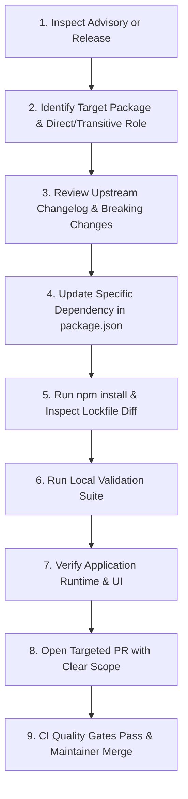

# PACT — Dependency Health, Security Auditing & Supply-Chain Policy

This document establishes the canonical policy, verification tooling, and operational runbooks for **dependency management, vulnerability auditing, and supply-chain hygiene** in the PACT Personal Operating System.

---

## 1. Purpose & Core Philosophy

As a high-integrity Personal Operating System handling confidential commitments, financial transactions, and cryptographic proofs, PACT maintains a strict zero-trust stance toward external supply-chain dependencies:

- **Minimal Surface Area**: Dependencies are introduced only when standard platform APIs and native JavaScript/TypeScript runtimes cannot achieve the architectural goal.
- **Deterministic Reproducibility**: Builds must be 100% reproducible across local contributor workstations and remote CI environments via strict lockfile enforcement.
- **Early Vulnerability Detection**: Automated scanners detect known Common Vulnerabilities and Exposures (CVEs) before code reaches production branches.
- **Transparent Upgrade Lifecycle**: Dependency upgrades are treated as intentional architectural changes, never automated blindly without review.

---

## 2. Dependency Architecture & Sources

PACT tracks third-party packages exclusively through the official npm registry across two canonical manifests:

```
Pact_OS/
├── package.json         # Declares direct production and development dependencies with semver ranges
└── package-lock.json    # Exact dependency tree, resolved sub-dependencies, integrity hashes, and versions
```

### Dependency Classification

| Layer | Purpose | Key Dependencies | Invariant Rules |
| :--- | :--- | :--- | :--- |
| **Production Runtime** (`dependencies`) | Packages required for runtime execution in the user browser or server runtime. | `next`, `react`, `react-dom`, `@supabase/ssr`, `@supabase/supabase-js`, `zod`, `lucide-react`, `framer-motion` | Must have 0 high/critical vulnerabilities. Kept as minimal and lightweight as possible. |
| **Development & Tooling** (`devDependencies`) | Packages used strictly during build, typechecking, linting, testing, and CI verification. | `typescript`, `tailwindcss`, `@tailwindcss/postcss`, `eslint`, `eslint-config-next`, `pg`, `@types/*` | Isolated from client bundles. Must pass automated security audits. |

---

## 3. Local Audit & Health Commands

Contributors and maintainers can verify dependency health locally using the following canonical commands:

```bash
# 1. Clean, lockfile-safe dependency installation
npm ci

# 2. Comprehensive automated dependency health and lockfile synchronization check
node scratch/check-dependency-health.mjs

# 3. Standard npm security vulnerability audit
npm audit

# 4. Strict high-severity threshold audit (fails on high or critical vulnerabilities)
npm audit --audit-level=high

# 5. Machine-readable audit report
npm audit --json
```

---

## 4. Vulnerability Severity & CI Quality Gate Policy

PACT evaluates dependency vulnerabilities according to CVSS severity ratings. Our automated CI quality gates enforce the following deterministic policy:

```
┌─────────────────┐     ┌────────────────────────────────────────────────────────┐     ┌──────────────┐
│  VULNERABILITY  │     │                       CI ACTION                        │     │  RESOLUTION  │
│    SEVERITY     │     │                                                        │     │  TIMEFRAME   │
├─────────────────┼────────────────────────────────────────────────────────┼──────────────┤
│ 🚨 CRITICAL     │ ✖ HARD BLOCK — Pipeline immediately fails. PR blocked.   │ Immediate    │
│ 🛑 HIGH         │ ✖ HARD BLOCK — Pipeline immediately fails. PR blocked.   │ < 48 Hours   │
│ ⚠️ MODERATE     │ ℹ WARNING — Logged in audit reports; requires triage.   │ Next Minor   │
│ 💡 LOW / INFO   │ ℹ INFORMATIONAL — Evaluated during routine reviews.      │ Scheduled    │
└─────────────────┘     └────────────────────────────────────────────────────────┘     └──────────────┘
```

### Policy Rules
1. **Zero Tolerance for High/Critical**: No PR or release will be merged if `npm audit --audit-level=high` or `scratch/check-dependency-health.mjs` reports unresolved High or Critical vulnerabilities.
2. **Lockfile Desynchronization**: Any mismatch between `package.json` and `package-lock.json` triggers an immediate CI failure.
3. **No Unreachable Blind Fixes**: Vulnerability remediation must be tested against the actual application test matrix (`node scratch/run-tests.mjs`) to prevent regressions.

---

## 5. Dependabot Automated Update Strategy

PACT uses GitHub Dependabot to provide continuous, non-intrusive monitoring of third-party package updates.

### Configuration (`.github/dependabot.yml`)

- **Ecosystem**: `npm`
- **Directory**: `/`
- **Schedule**: Weekly on Monday at 06:00 UTC
- **Target Branch**: `main`
- **Open PR Limit**: 10
- **Labels Applied**: `type:security`, `area:developer-experience`

### Grouping Strategy
To avoid pull request notification fatigue while maintaining clear visibility into breaking changes:
- **Grouped Minor & Patch Updates**: Compatible patch and minor updates are grouped into consolidated PRs for `production-dependencies` and `development-dependencies`.
- **Isolated Major Updates**: Major version bumps (e.g., Next.js, React, TypeScript, Tailwind) generate standalone pull requests with individual changelogs for careful architectural review.

---

## 6. Safe Dependency Update Workflow

Maintainers and contributors must follow this 9-step workflow when updating dependencies or addressing security advisories:



### Detailed Steps:
1. **Inspect Advisory**: Review the CVE description, affected semver range, and CVSS severity score.
2. **Identify Role**: Determine whether the affected package is a direct dependency or a transitive sub-dependency.
3. **Review Changelog**: Read upstream release notes to identify breaking changes or migration requirements.
4. **Update Minimal Package**: Update only the specific package version required. Do NOT run broad `npm update` commands.
5. **Verify Lockfile**: Inspect `git diff package-lock.json` to ensure only the intended dependency tree was modified.
6. **Execute Local Suite**:
   ```bash
   node scratch/check-dependency-health.mjs
   npx eslint src/
   npx tsc --noEmit
   node scratch/run-tests.mjs
   npm run build
   ```
7. **Verify Application UI**: Run `npm run dev` and smoke test related features.
8. **Open Targeted PR**: Use the `chore(deps): ...` or `fix(security): ...` commit convention.
9. **Merge**: Once CI quality gates pass and maintainer review is approved.

---

## 7. Emergency Vulnerability Response Protocol

In the event of an active zero-day exploit or critical CVSS 9.0+ advisory affecting a core production dependency:

1. **Triage & Containment**: Project maintainers immediately verify exploitability within PACT's specific runtime configuration.
2. **Private Development**: A security fix is authored in a private branch or fork to prevent premature public disclosure.
3. **Upstream Mitigation**: If an upstream patch is not yet available, apply a safe local override or temporary functional fallback.
4. **Fast-Track Review**: Run full CI regression gates (`.github/workflows/ci.yml` and `.github/workflows/dependency-audit.yml`).
5. **Direct Main Merge & Advisory**: Merge the patch to `main` and publish a GitHub Security Advisory detailing the remediation.

---

## 8. False Positives & Security Exception Protocol

In rare scenarios where an upstream advisory is confirmed to be a false positive (e.g., vulnerable code path in a dev-only tool that is never executed in production or build time), maintainers may document an explicit temporary exception.

### Exception Governance Rules
- **No Casual Suppression**: Running `npm audit --fix --force` or blindly hiding warnings with `|| true` is strictly prohibited.
- **Mandatory Documentation**: Every exception must be recorded in this section with the following template:

```markdown
### Exception Record Template
- **Package**: `<package-name>`
- **Advisory / CVE**: `<CVE-ID or GHSA-ID>`
- **Severity**: `<Moderate / High>`
- **Affected Version**: `<version>`
- **Architectural Rationale**: `<Why this is non-exploitable in PACT>`
- **Mitigation / Workaround**: `<Active defensive measure>`
- **Review Expiration Date**: `<YYYY-MM-DD (Max 90 days)>`
- **Approved By**: `<Maintainer GitHub handle>`
```

*(Currently, PACT has **0 active exceptions**. The dependency tree is 100% clean of known advisories.)*

---

## 9. Supply-Chain Security Principles

To protect PACT against supply-chain attacks, typo-squatting, and dependency hijacking:

1. **Lockfile Immutability**: All CI workflows use `npm ci` rather than `npm install` to guarantee strict lockfile compliance.
2. **Zero Wildcard Versions**: Package versions must specify bounded semver ranges; wildcards (`*`) and `latest` tags are prohibited.
3. **Zero Embedded Secrets**: Package scripts and configuration files must never reference or print environment variables, API tokens, or private keys.
4. **Trusted Provenance**: Only well-established, actively maintained packages with verifiable source repositories are accepted into the PACT architecture.
5. **Pruning Dead Dependencies**: Unused packages must be removed immediately rather than maintained as technical debt.
