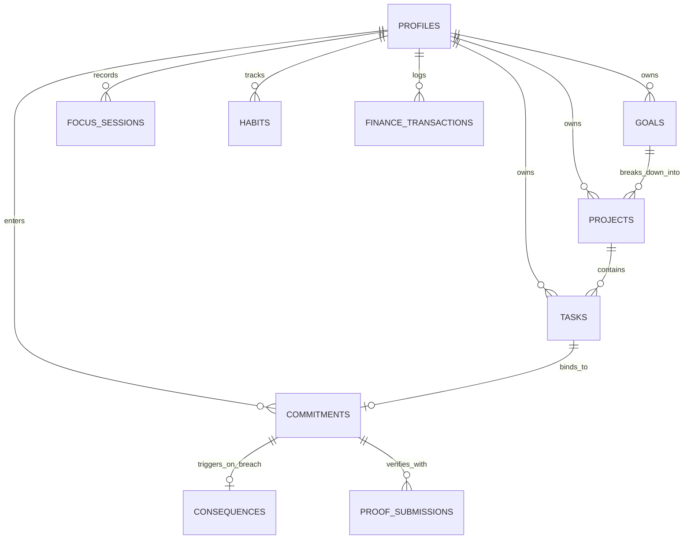

# PACT — Master Technical & Product Documentation

> **Dual Tagline**: *"A System for Keeping Promises to Yourself."* / *"Turn Intent Into Discipline"*  
> **Version**: 1.0.0 (Production Certified)  
> **Repository**: `pact-os`  
> **Last Verified**: September 2026  

---

## 1. Product Overview

### 1.1 What PACT Is
**PACT** is a production-hardened **Personal Operating System (OS)** engineered to bridge the critical gap between intention and execution. Rather than acting as a passive to-do list, PACT operates as an active governance system for personal productivity, time allocation, deep work, financial discipline, and commitment integrity.

### 1.2 Core Problem Solved
Traditional productivity software suffers from "passive accumulation": tasks, goals, and habits are created with high enthusiasm but abandoned without consequence when friction occurs. PACT solves this by introducing:
1. **Unbreakable Accountability**: Commitments tied to explicit deadlines, verified proofs, and enforceable consequences.
2. **Temporal Truth**: Time-blocked planning with bi-directional calendar synchronization.
3. **Objective Verification**: Automated proof-of-work validation via external developer and learning platforms.
4. **Holistic Governance**: Unified management of tasks, strategic goals, projects, routines, deep work focus, and financial cash flow.

### 1.3 Core Product Principles
- **Discipline Over Fleeting Motivation**: Systems and automated boundaries prevent regression.
- **Fail-Safe Integrity**: Integration downtime or network partitions never compromise user integrity.
- **Zero-Trust Data Boundaries**: Sensitive commitment consequences and user secrets remain strictly encrypted and confidential.
- **Deterministic State Machines**: Every entity follows an explicit, auditable lifecycle.

---

## 2. Product Systems & Modules

PACT is composed of 14 integrated systems operating under a unified dashboard shell:

| System | Route | Primary Responsibility | Current Status |
| :--- | :--- | :--- | :--- |
| **Command Center** | `/app` | Global overview, quick capture, metrics & universal search | **IMPLEMENTED** |
| **Planner** | `/app/planner` | Day/Week/Month time-blocking and scheduling | **IMPLEMENTED** |
| **Goals** | `/app/goals` | Strategic long-term objectives & milestone tracking | **IMPLEMENTED** |
| **Projects** | `/app/projects` | Scoped initiatives, deliverables & phase execution | **IMPLEMENTED** |
| **Tasks** | `/app/tasks` | Task backlog, execution, priority & deadline tracking | **IMPLEMENTED** |
| **Accountability** | `/app/accountability` | Commitments, confidential consequences & resolution | **IMPLEMENTED** |
| **Finance** | `/app/finance` | Integer-cents cash flow, recurring expenses & budgets | **IMPLEMENTED** |
| **Focus Timer** | `/app/focus` | Deep work sessions, Web Audio chimes & focus logs | **IMPLEMENTED** |
| **Habits & Routines** | `/app/habits` | Recurring habit loops, daily routines & streak engines | **IMPLEMENTED** |
| **Analytics** | `/app/analytics` | Completion velocity, historical trends & scorecards | **IMPLEMENTED** |
| **Weekly Review** | `/app/review` | 5-step guided Sunday planning ritual & review wizard | **IMPLEMENTED** |
| **Integrations** | `/app/integrations` | Connectors for Google Calendar, GitHub, LeetCode, Codeforces | **IMPLEMENTED** |
| **Notifications** | Global Shell | Multi-channel alerts (In-App, Email, Webhook) | **IMPLEMENTED** |
| **Settings & Export**| `/app/settings` | Profile, theme tokens, notification channels & data portability | **IMPLEMENTED** |

---

## 3. System Architecture

```
                                  +-------------------------------------------------+
                                  |                 Client Layer                    |
                                  | Next.js 16 (React 19) + Tailwind CSS v4 + Framer |
                                  +-------------------------------------------------+
                                                          |
                                            Server Actions & Route Handlers
                                                          |
                                  +-------------------------------------------------+
                                  |              Application Core (lib/)            |
                                  |  - Accountability Engine   - Focus Engine       |
                                  |  - Financial Discipline    - Habits & Routines  |
                                  |  - External Proof Sweeper  - Analytics Matrix   |
                                  |  - Google Calendar Sync    - Export Sanitizer   |
                                  +-------------------------------------------------+
                                                          |
                                             Supabase SSR / Postgres Client
                                                          |
                                  +-------------------------------------------------+
                                  |               Database Layer (PostgreSQL)       |
                                  |  - Row Level Security (RLS) on All Tables       |
                                  |  - pg_cron Deadline Sweeper Engine              |
                                  |  - Database State Triggers & Audit Records      |
                                  +-------------------------------------------------+
```

### 3.1 Frontend Architecture
- **Framework**: Next.js 16 (App Router) with React 19.
- **Styling**: Tailwind CSS v4 with dark glassmorphism, semantic design tokens, and luxury gold accents (`#d4af37`).
- **Motion**: Framer Motion for hardware-accelerated transitions and background OS core ambient lighting.
- **URL State**: Deterministic bidirectional URL query synchronization (`useUrlState`) for filters, search terms, and active tabs.

### 3.2 Backend & Data Layer
- **Database**: Supabase PostgreSQL with 20 idempotent schema migrations.
- **Mutations**: Type-safe Next.js Server Actions with strict Zod validation schemas (`lib/validations/`).
- **Authorization**: Row Level Security (RLS) enabled on 100% of tables with zero-trust server-side identity verification via `supabase.auth.getUser()`.

---

## 4. Data Model & Entity Relationships

PACT structures data in a clean, normalized relational model:



### 4.1 Key Relational Entities
1. **`profiles`**: User timezone, identity preferences, onboarding status, and metadata.
2. **`tasks`**: Work items with status, priority, estimated duration, scheduled times, and deadline.
3. **`commitments`**: Formal contracts binding a task to an accountability rule, consequence, or external proof.
4. **`consequences`**: Confidential penalty definitions (e.g., social forfeit, financial pledge, accountability partner notification).
5. **`finance_transactions`**: Financial ledger entries stored in integer cents (`amount_cents`) with category and recurrence links.
6. **`focus_sessions`**: Deep work time logs with target duration, actual duration, and completion status.
7. **`habits` & `habit_logs`**: Habit definitions, completion frequencies, and daily completion logs.
8. **`weekly_reviews`**: Sunday review records containing reflection responses, scorecard metrics, and commitments for the upcoming week.

---

## 5. Authentication & Authorization

### 5.1 Authentication Flows
- **Unified Landing Page (`/`)**: In-place single-screen authentication experience supporting both **Email/Password** and **Google OAuth**.
- **Password Recovery**: Secure email-based reset flow redirecting to authenticated settings.
- **Session Handling**: Managed via `@supabase/ssr` with HttpOnly cookies, automatic token refreshing, and server-side middleware protection.

### 5.2 Authorization Policies
- Every query enforces strict user isolation through Supabase RLS: `auth.uid() = user_id`.
- Confidential consequence descriptions are masked from client responses until a commitment enters an activated breach state.

---

## 6. Accountability & Consequence Engine

### 6.1 Commitment Lifecycle State Machine
```
[DRAFT] ──> [ACTIVE] ──> [COMPLETED] (Verified / Fulfilled)
               │
               └──> [BREACHED] ──> [CONSEQUENCE_ACTIVATED] ──> [RESOLVED]
               │
               └──> [WAIVED] (Controlled exception with audit reason)
```

### 6.2 Autonomous Deadline Sweeper
- Background cron runner triggered via `/api/cron/sweep-deadlines` (authorized with timing-safe `CRON_SECRET` headers) and database `pg_cron`.
- Inspects pending deadlines, evaluates grace periods, transitions expired tasks to `missed`, and escalates breached commitments to active consequence status.

---

## 7. Financial Discipline System

### 7.1 Integer-Cents Arithmetic
To prevent floating-point inaccuracies, all financial data is stored and calculated in integer cents (`amount_cents`, `limit_cents`). Helper utilities in `lib/money.ts` handle formatting, currency symbols, and mathematical operations.

### 7.2 Core Capabilities
- **Transaction Ledger**: Track income, fixed expenses, and variable expenses.
- **Budget Envelopes**: Set category-specific spending limits with automated visual thresholds (Warning at 80%, Breach at 100%).
- **Recurring Cash Flow Engine**: Predict recurring monthly overhead and net cash balance.

---

## 8. Integrations & External Proof-of-Work

| Connector | Type | Implementation Status | Purpose |
| :--- | :--- | :--- | :--- |
| **Google Calendar** | OAuth 2.0 Bi-directional | **IMPLEMENTED** | Synchronize time-blocks, import external events, and detect schedule conflicts. |
| **GitHub** | REST API / Webhook | **IMPLEMENTED** | Verify commit activity, merged pull requests, and contribution counts as objective proof. |
| **LeetCode** | Public GraphQL API | **IMPLEMENTED** | Verify daily problem completions and submission counts without storing credentials. |
| **Codeforces** | Official REST API | **IMPLEMENTED** | Verify contest participation and problem submissions against public handles. |

### 8.1 Fail-Safe Guarantee
If an external API experiences an outage, network timeout, or rate limit, the verification engine enters a `RETRY_PENDING` state. **A user's commitment is never failed due to third-party infrastructure failures.**

---

## 9. UI/UX System & Design Tokens

### 9.1 Aesthetic Foundation
PACT is built with a bespoke **Dark Glassmorphic** theme using deep near-black surfaces, subtle specular borders, and restrained warm gold accents:

- **Canvas Base**: `#060608` / `#09090b`
- **Surface Cards**: `rgba(18, 18, 23, 0.75)` with `backdrop-filter: blur(16px)`
- **Brand Gold**: `#d4af37` (Primary), `#f5e0a3` (Specular highlight), `#aa820a` (Deep gold)
- **Border Subtlety**: `rgba(255, 255, 255, 0.08)`
- **Typography**: Inter / Geist Sans with high-contrast hierarchy and monospace accents for metric timestamps.

---

## 10. Development & Testing Workflow

### 10.1 Quick Start
```bash
# 1. Install dependencies
npm install

# 2. Configure local environment
cp .env.example .env.local

# 3. Start local development server
npm run dev
```

### 10.2 Test Suite Execution
PACT features an automated 34-suite test matrix covering all core domain engines:
```bash
# Run comprehensive test suite
node scratch/run-tests.mjs

# Run secret scanner
node scratch/secret-scan.mjs

# Typecheck & Lint
npx tsc --noEmit
npm run lint
```

---

## 11. Security & Data Privacy

1. **Zero Client Trust**: All user identity checks are strictly evaluated on the server using verified JWT claims.
2. **Data Portability (`/api/user/export`)**: Complete RFC 4180 ZIP/JSON export of all user entities with automated secret stripping (removing OAuth tokens, refresh tokens, and password hashes).
3. **Secret Hygiene**: Strict pre-commit verification ensuring zero API keys or credentials exist in git history.

---

## 12. Current Project Status & Roadmap

### Current Status: **Production Ready (Certified)**
All 14 core product modules, the automated deadline sweeping engine, external proof connectors, the 34-suite test matrix, and the single-screen landing experience are fully built, tested, and certified.

### Future Roadmap
- **Mobile Native Companion**: React Native / Expo companion app for push notifications and on-the-go quick capture.
- **Biometric Passkey Support**: WebAuthn/FIDO2 passwordless biometric authentication.
- **Local-First Offline Sync**: CRDT-based client synchronization for offline planning.
