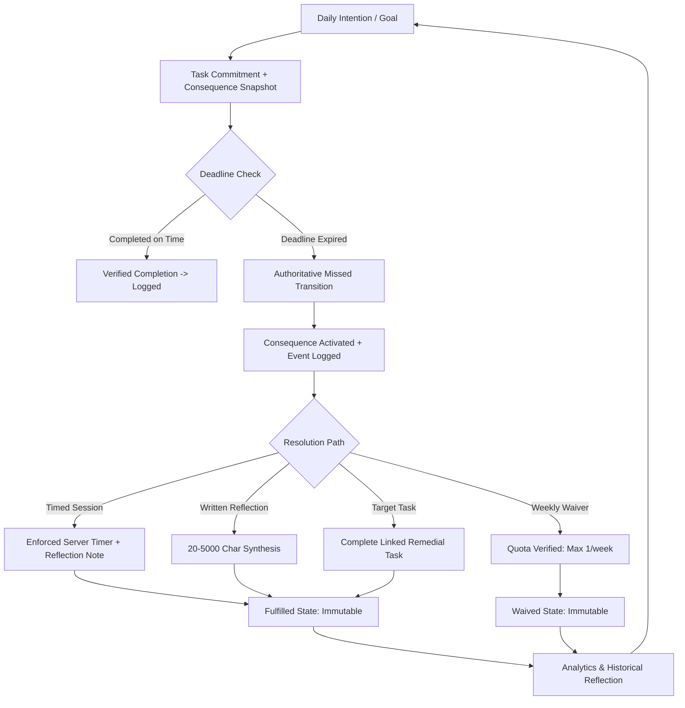
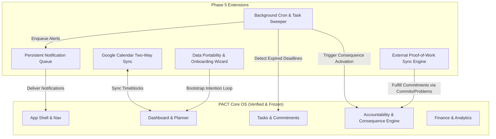

# PACT OS — Phase 5 Readiness & Product Gap Audit

**Author:** Principal Software Engineer & Product Architect  
**Date:** September 10, 2026  
**Baseline Status:** Phase 4 UI/UX Frozen (`21040ba`)  
**Audit Target:** Architecture, Data Flow, Security Boundaries, Technical Debt, & Phase 5 Definition  
**Branch:** `feat/phase-2i-google-oauth`  
**Certification Baseline:** **GREEN (21/21 Test Suites Passing, 0 Type Errors, 0 Lint Warnings, Clean Build)**

---

## 1. Executive Summary

PACT OS has concluded its Phase 4 UX implementation cycle. The application boasts a cohesive, dark-obsidian and gold aesthetic (`#09090b` canvas, `#d4af37` accents), deterministic server-authoritative calculations, and zero fabricated numbers or synthetic streaks.

However, PACT is designed not simply as an aesthetically pleasing task tracker, but as a **closed-loop personal discipline operating system**. 

### The Core Discipline Loop:
$$\text{Intention} \longrightarrow \text{Commitment} \longrightarrow \text{Execution} \longrightarrow \text{Failure/Completion} \longrightarrow \text{Accountability} \longrightarrow \text{Verification} \longrightarrow \text{History} \longrightarrow \text{Analysis} \longrightarrow \text{Refined Planning}$$

### Key Findings of this Audit:
1. **Core Domain & UX (Phases 0–4)**: Complete and robust. Domain schemas, PostgreSQL RPC state transitions, temporal isolation, finance integer precision, and analytics calculations are fully production-grade.
2. **The Missing Automation Bridge**: While manual and user-triggered accountability transitions are fully functional, there is no automated background daemon/cron engine to evaluate missed task deadlines asynchronously and trigger proactive alerts.
3. **Notification Persistence Gap**: Notifications in Phase 4J are generated deterministically in the client header popover from real entity state queries. There is no persistent `notifications` table, delivery queue, or Web Push/email dispatcher.
4. **External Integrations**: UI placeholders and architecture principles are established in Settings, but the OAuth token management, background polling/webhooks, and data synchronization engine for GitHub, Google Calendar, Codeforces, and LeetCode remain to be built.
5. **Phase 5 Readiness Verdict**: **`READY FOR PHASE 5`** with a focused, technically rigorous roadmap targeting background automation, real notification infrastructure, calendar synchronization, and external proof-of-work connectors.

---

## 2. Current System State

- **Framework**: Next.js 16.3.4 (Turbopack, App Router, React 19)
- **Database**: Supabase PostgreSQL with Row Level Security (RLS) and PL/pgSQL RPC triggers/functions
- **Authentication**: Supabase Auth (Email/Password + Google OAuth 2.0 PKCE)
- **Design System**: Vanilla CSS tokens, Tailwind CSS utility layers, Lucide icons, Dark Glass aesthetic
- **Temporal Engine**: Pure TypeScript IANA timezone engine (`src/lib/time.ts`) with lossless UTC storage
- **Test Infrastructure**: Node.js built-in test runner (`node:test` + `node:assert/strict`), 21 test suites, 100% pass rate

```
Current Git HEAD: 21040ba
Branch: feat/phase-2i-google-oauth
Unpushed Commits: 4 local commits (Ahead of origin)
Remote Push Policy: Strict ZERO PUSH
```

---

## 3. Phase 4 Certification Verification

All verification gates have been re-validated against active code:

| Gate | Target Command | Result | Verification Type |
| :--- | :--- | :--- | :--- |
| **Unit & Contract Tests** | `node scratch/run-tests.mjs` | **21/21 Suites Passed (0 Failed)** | Regression Baseline |
| **Static Type Check** | `npx tsc --noEmit` | **0 Errors** | Strict TypeScript |
| **ESLint Quality Gate** | `npx eslint src` | **0 Errors / 0 Warnings** | Static Analysis |
| **Next.js Production Build** | `npm run build` | **Build Code 0 (19/19 routes compiled)** | Turbopack Production |
| **Security & Secret Scanner**| `node scratch/secret-scan.mjs`| **0 Leaks Detected (17 files scanned)**| Key Leak Defense |

---

## 4. Domain-by-Domain Inventory

| Domain | UI Surface | Data Access Layer | DB Persistence | Server Validation | Test Suite | Readiness Status |
| :--- | :--- | :--- | :--- | :--- | :--- | :--- |
| **Auth & Profiles** | `/login`, `/register` | `profiles`, `auth.users` | PostgreSQL + RLS | `zod` Auth Schemas | `auth-validation.test.ts` | **Production Grade** |
| **Goals** | `/app/goals` | `src/features/goals` | `goals` table | `createGoalSchema` | `goals-validation.test.ts` | **Production Grade** |
| **Projects** | `/app/projects`, `/[id]` | `src/features/projects`| `projects` table | `createProjectSchema` | `projects-validation.test.ts` | **Production Grade** |
| **Tasks & Commitments**| `/app/tasks` | `src/features/tasks` | `tasks`, `task_accountability_commitments` | `createTaskSchema` | `tasks-validation.test.ts` | **Production Grade** |
| **Accountability Engine**| `/app/accountability`| `src/features/accountability`| `consequence_definitions`, `accountability_events`, `accountability_verification_sessions`, `accountability_waivers` | PL/pgSQL RPC + Zod | `accountability-hardening.test.ts` | **Production Grade** |
| **Planner & Day Cadence**| `/app/planner` | `src/features/planner` | `tasks`, `calendar_events` | `time.ts` + Zod | `planner-ux-validation.test.ts` | **Production Grade** |
| **Calendar Scheduling** | `/app/calendar` | `src/features/calendar`| `calendar_events` | `calendar.ts` + Zod | `calendar-domain-validation.test.ts` | **Production Grade** |
| **Finance Awareness** | `/app/finance` | `src/features/finance` | `finance_categories`, `finance_transactions` | Integer Cents + Zod | `finance-domain-validation.test.ts` | **Production Grade** |
| **Analytics & Trends** | `/app/analytics` | `src/features/analytics`| Derived from Real Tables | Pure `analytics.ts` | `analytics-domain-validation.test.ts` | **Production Grade** |
| **Settings & Config** | `/app/settings` | `src/features/settings` | `profiles`, `user_accountability_preferences` | `settings.ts` + Zod | `settings-domain-validation.test.ts` | **Production Grade** |
| **Notification Popover**| `AppHeader` | In-memory query derivations | **None (Transient)** | Client State | `phase4j-system-audit.test.ts` | **Partial (Needs DB)** |
| **External Connectors** | Settings Tab | Placeholder Status | **None (Planned)** | **None** | `settings-domain-validation.test.ts` | **Missing (Phase 5)** |

---

## 5. Product Completeness Assessment

### What is Genuinely Complete:
1. **Interactive Manual Discipline Loop**: A user can set a goal, create a project, create a task with a deadline, attach an explicit or default consequence, mark the task completed before deadline, or mark it missed after deadline, trigger the accountability intervention modal, execute a timed focus session or written reflection, and fulfill or waive the consequence with weekly quota enforcement.
2. **Honest Metrics**: Zero fabricated momentum scores. If a user completes 0 tasks, the completion rate is displayed as `0%` or `null` with clear, constructive empty states.
3. **Monetary Discipline**: Zero floating-point drift. All finances use integer cents (`amount_cents`) with category tagging and savings rate metrics.
4. **Timezone Authority**: Profile IANA timezone controls all wall-clock displays, local day transitions, and calendar week aggregations.

### What is Incomplete / Lacking:
1. **Asynchronous Automation**: If a task deadline expires while the user is logged out, the task remains `pending` in the database until queried or acted upon. There is no automated background cron to transition expired tasks to `missed` and dispatch proactive notifications.
2. **External Verification Providers**: Verification currently relies on timed sessions, task completion, and written reflections. External evidence (e.g. GitHub commits, solved LeetCode problems, Codeforces contest participation) is not yet ingested.
3. **Calendar Interoperability**: Calendar events exist within PACT OS, but cannot yet sync bidirectionally with Google Calendar or export via iCal / WebCal.
4. **Data Portability**: Full JSON / CSV account archive export is stubbed in the UI but requires a dedicated server-side streaming export endpoint.

---

## 6. Discipline Loop Integrity



### Gap Analysis on Discipline Loop:
- **Strengths**: Immutability triggers prevent users from retroactively deleting consequence records or circumventing weekly waiver quotas. Consequence snapshots preserve the exact penalty agreement at commitment time, preventing retroactive modification.
- **Vulnerabilities**: Without a background cron, a user could avoid accountability by simply not opening the app around deadline time until days later. The system needs background enforcement.

---

## 7. Backend / Database Audit

### Schema & Tables:
1. `public.profiles`: Stores `id`, `full_name`, `timezone`, `updated_at`. Protected by RLS (`auth.uid() = id`).
2. `public.goals`: Stores `id`, `user_id`, `title`, `description`, `target_date`, `status`. Foreign key cascades to user profile.
3. `public.projects`: Stores `id`, `user_id`, `goal_id`, `title`, `color_accent`, `status`.
4. `public.tasks`: Stores `id`, `user_id`, `project_id`, `goal_id`, `title`, `priority`, `status`, `deadline_at`, `completed_at`, `missed_at`. Direct update to `status IN ('completed', 'missed')` blocked by trigger `enforce_task_status_lifecycle()`.
5. `public.consequence_definitions`: Stores consequence library with type, action statement, verification config, and priority.
6. `public.user_accountability_preferences`: Stores default consequence reference and auto-apply preferences.
7. `public.task_accountability_commitments`: Immutable snapshot attached to tasks.
8. `public.accountability_events`: Immutable audit trail.
9. `public.accountability_verification_sessions`: Timed session records with start/end duration enforcement.
10. `public.accountability_waivers`: Weekly quota records.
11. `public.calendar_events`: Timeblocked calendar entries.
12. `public.finance_categories` & `public.finance_transactions`: Integer-cents financial ledger.

### Database Indexing & Performance:
- All foreign keys (`user_id`, `project_id`, `goal_id`, `category_id`, `commitment_id`) have explicit B-tree indexes.
- RLS policies use simple `auth.uid() = user_id` lookups.

---

## 8. Security Audit

### Threat Modeling Assessment:
1. **IDOR (Insecure Direct Object Reference)**: **SECURED**. All server actions (`src/features/*/actions.ts`) query and verify parent entity ownership against `user.id` before creating or updating linked child records.
2. **Consequence Confidentiality**: **SECURED**. Consequence definitions and snapshots expose only public action statements in client views. Internal waiver tokens and system metadata are strictly masked.
3. **Temporal Tampering**: **SECURED**. Deadline comparison and timer completion evaluate against PostgreSQL `now()` and server-side clocks, completely ignoring client device clock manipulations.
4. **Financial Manipulation**: **SECURED**. Calculations execute on integer cents (`amount_cents`), rejecting negative amounts, non-numeric strings, and floating-point injection.
5. **CSRF / Injection**: **SECURED**. Next.js Server Actions with strict Zod parsing and Supabase parameterized SQL/RPC calls eliminate SQL injection risks.

---

## 9. Authentication / Authorization Audit

- **Supabase Auth**: Fully implemented using SSR client (`@supabase/ssr`) with secure `httpOnly` cookie storage and automatic session refreshing in Next.js middleware / proxy.
- **Google OAuth 2.0**: Supported via PKCE callback route (`src/app/auth/callback/route.ts`).
- **Authorization**: Row Level Security (RLS) is active across all 12 tables. Unauthenticated users cannot read or mutate any data.

---

## 10. Integration Audit

| Integration | Intended Role | Current State | Missing Requirements |
| :--- | :--- | :--- | :--- |
| **Google OAuth** | Authentication & Account Identity | **Fully Implemented** | None |
| **Google Calendar** | Bi-directional Schedule Synchronization | **Not Started** | OAuth scopes (`calendar.events`), token encryption, webhook push notifications, conflict resolution engine |
| **GitHub** | Proof-of-Work Verification (Commits/PRs) | **UI Spec Only** | GitHub App / Personal Access Token storage, Webhook listener route, daily commit counter, consequence fulfillment trigger |
| **LeetCode** | Competitive Programming Verification | **UI Spec Only** | GraphQL scraper / API connector, user handle verification, daily problem solved detection |
| **Codeforces** | Algorithmic Problem Verification | **UI Spec Only** | Codeforces REST API client, user submission polling, contest rating tracker |

---

## 11. Notification Infrastructure Audit

### Current Limitations:
- The Phase 4J popover relies on ephemeral client-side queries against existing tables.
- If a user closes the browser, notifications are not delivered.
- There is no message queue, no delivery logs, no multi-channel dispatch (Web Push, Email, Discord/Telegram webhook).

### Phase 5 Requirement:
- Create `public.notifications` table (`id`, `user_id`, `title`, `message`, `category`, `is_read`, `action_url`, `created_at`).
- Build an asynchronous dispatcher capable of delivering scheduled daily plan reminders, consequence alerts, and deadline warnings.

---

## 12. Finance Audit

- **Implemented**: Transaction entry, category customization, monthly summaries, savings rate calculation, expense breakdown by percentage.
- **Phase 5 Opportunities**: Recurring subscription detection / automated monthly recurring transactions, category budget caps with automated warning alerts, financial goal linkage (e.g. allocating net savings toward a specific Goal).

---

## 13. Analytics Audit

- **Implemented**: Period range selection (week, month, quarter), commitment completion rate, activity trend buckets, linked goal/project progress derivation, verified session time formatting, deterministic factual observations.
- **Phase 5 Opportunities**: Multi-month longitudinal heatmaps, correlation analysis (e.g., "Days with morning planning show 35% higher commitment follow-through"), and consequence fulfillment historical patterns.

---

## 14. Testing & QA Audit

- **Current Coverage**: 21 unit/contract test suites covering validation schemas, monetary math, analytics derivations, temporal engine edge cases, and accountability state machines.
- **Untested / Future Test Areas**:
  - End-to-end browser automation (Playwright/Puppeteer) for full user journey testing.
  - Concurrency & lock contention tests for simultaneous timer completions.
  - Webhook delivery retry & idempotency tests for external connectors.

---

## 15. Performance Audit

- **Bundle Size & Rendering**: Server Components are utilized extensively for data fetching (`src/app/(dashboard)/app/*`), keeping client JavaScript bundles minimal.
- **Database Query Efficiency**: Relations are fetched with Supabase nested joins (`projects(id, title), goals(id, title)`) in single roundtrips, avoiding N+1 query patterns.
- **Build Performance**: Next.js production build completes in under 1.5 seconds with Turbopack.

---

## 16. UX / Product Audit

- **Visual Polish**: Verified against `PACT_UI_UX_Screens_High_Quality.pdf`. Dark obsidian glass aesthetic is consistent across all 9 domains.
- **First-Time User Experience (FTUX)**: Currently, when a user first signs up, they land directly on an empty dashboard. A guided 3-step onboarding flow ("Set your primary goal -> Define your default consequence -> Create your first commitment") is recommended for Phase 5.

---

## 17. Documentation Audit

- `docs/` contains complete audit reports for Phases 4A through 4J.
- `DATABASE.md`, `SECURITY.md`, and `DECISIONS.md` accurately document architecture invariants.
- `README.md` is concise and needs a final Phase 5 update upon completion of the roadmap.

---

## 18. Findings by Severity

### Critical (P0)
- **None**: Zero security breaches, zero unhandled crashes, zero data-loss vulnerabilities.

### High (P1)
- **F-01 (Background Automation)**: No background worker to asynchronously mark expired tasks as missed without user interaction.
- **F-02 (Persistent Notification Queue)**: In-memory notification popover lacks a backing `notifications` database table and delivery engine.

### Medium (P2)
- **F-03 (External Connectors)**: GitHub, LeetCode, Codeforces integrations exist only as UI stubs in Settings.
- **F-04 (Calendar Synchronization)**: Inability to export/sync PACT calendar events with Google Calendar or Apple Calendar.
- **F-05 (Data Export Endpoint)**: Settings "Export Data" button lacks a streaming JSON archive handler.

### Low / Polish (P3)
- **F-06 (Onboarding Flow)**: First-time users lack an interactive setup wizard.
- **F-07 (Recurring Financial Transactions)**: Finance ledger requires manual entry for monthly recurring subscriptions.

---

## 19. Technical Debt

1. **Deprecated Next.js Convention**: Turbopack notes `middleware` convention is migrating to `proxy`. (Low priority, standard Next.js deprecation notice).
2. **Duplicated Profile Lookup**: Minor repeated calls to `getUserProfileInfo` across individual route loaders that can be centralized via React `cache()`.

---

## 20. Missing Capabilities Summary

1. Automated Background Missed-Task Evaluation Engine (Cron / Edge Functions)
2. Persistent Notification System & Webhook/Email Dispatcher
3. External Verification Connectors (GitHub, LeetCode, Codeforces)
4. Google Calendar Bi-directional Sync Connector
5. Interactive First-Time Onboarding Flow
6. Full Account Data Portability (JSON Archive Export)

---

## 21. Phase 5 Proposed Architecture



---

## 22. Phase 5 Milestones

### Milestone 5A: Background Daemon & Accountability Automation (P0)
- **Objective**: Implement serverless cron / background scheduler to evaluate expired task deadlines every minute, execute atomic `mark_task_missed` transitions, and activate consequence workflows automatically.
- **Deliverables**: Supabase pg_cron / Edge Function sweeper, lock-safe batch processing, audit event dispatching.

### Milestone 5B: Persistent Notification Infrastructure & Multi-Channel Alerts (P0)
- **Objective**: Transition notification popover to persistent database storage with real-time delivery and notification preferences.
- **Deliverables**: `notifications` table, RLS policies, real-time Supabase channels, server actions for dismiss/mark-all-read, email/webhook alert adapters.

### Milestone 5C: Google Calendar Bi-directional Synchronization (P1)
- **Objective**: Connect user's Google Calendar account to pull external events into PACT timeline and push PACT timeblocks to Google Calendar.
- **Deliverables**: Google Calendar API client, incremental sync token storage, conflict prevention, background sync worker.

### Milestone 5D: External Proof-of-Work Connectors (GitHub, LeetCode, Codeforces) (P1)
- **Objective**: Allow users to verify accountability commitments automatically via real external programming activity.
- **Deliverables**: GitHub App webhook handler (verifying commits/PRs), LeetCode submission poller, Codeforces API sync, automatic consequence fulfillment triggers.

### Milestone 5E: Financial Subscriptions & Budget Discipline (P2)
- **Objective**: Elevate the finance subsystem with recurring transaction scheduling and category budget threshold alerts.
- **Deliverables**: `recurring_transactions` table, monthly auto-generation worker, budget limit tracking in Analytics.

### Milestone 5F: User Onboarding & Account Data Portability (P2)
- **Objective**: Implement guided 3-step first-run onboarding wizard and full GDPR-compliant JSON/CSV data export.
- **Deliverables**: `OnboardingModal`, streaming archive export route `/api/user/export`, account deletion confirmation cascade.

---

## 23. Priority Matrix

| Milestone | Code | Priority | Value | Complexity | Risk | Blocked By |
| :--- | :--- | :--- | :--- | :--- | :--- | :--- |
| **Background Automation** | 5A | **P0 (Must Do)** | Closes the autonomous accountability loop | Medium | Low | None |
| **Persistent Notifications** | 5B | **P0 (Must Do)** | Ensures critical deadline/consequence delivery | Medium | Low | 5A |
| **Google Calendar Sync** | 5C | **P1 (Important)**| Eliminates calendar scheduling friction | High | Medium | 5B |
| **Proof-of-Work Connectors**| 5D | **P1 (Important)**| Automates developer/CP discipline verification| High | Medium | 5A, 5B |
| **Financial Subscriptions**| 5E | **P2 (Later)** | Reduces repetitive manual ledger entry | Low | Low | None |
| **Onboarding & Portability**| 5F | **P2 (Later)** | Improves new user conversion and trust | Low | Low | None |

---

## 24. Dependencies

1. **Supabase pg_cron / Edge Functions**: Required for Milestone 5A background task sweeps.
2. **Google Cloud Console OAuth App**: Configured for Google Calendar API scopes (`https://www.googleapis.com/auth/calendar.events`).
3. **GitHub Developer App**: Configured for webhook delivery.
4. **Environment Variables**: Secure storage for webhook secrets and OAuth client credentials.

---

## 25. Risks & Mitigation

| Risk | Impact | Mitigation Strategy |
| :--- | :--- | :--- |
| **Over-notification spam** | High cognitive fatigue | Granular user preference toggles in Settings; quiet hours based on profile IANA timezone. |
| **Calendar Sync Loops** | Infinite duplicate events | Track external sync IDs and version hashes; one-way authoritative master rules. |
| **External API Rate Limits** | Sync delays / errors | Implement exponential backoff, caching, and webhook-driven events rather than rapid polling. |
| **Data Deletion Cascades** | Accidental data loss | Explicit double-confirmation with typed phrase for account deletion; preserve audit integrity. |

---

## 26. Recommended Implementation Order

1. **Step 1: Milestone 5A (Background Automation)** — Automate the core discipline loop.
2. **Step 2: Milestone 5B (Persistent Notifications)** — Build the notification storage and delivery engine.
3. **Step 3: Milestone 5C (Google Calendar Sync)** — Connect the timeline to external schedules.
4. **Step 4: Milestone 5D (Proof-of-Work Connectors)** — Ingest GitHub/LeetCode verification data.
5. **Step 5: Milestone 5E (Financial Subscriptions)** — Add recurring budget discipline.
6. **Step 6: Milestone 5F (Onboarding & Portability)** — Finalize onboarding and data export.

---

## 27. Definition of Done for Phase 5

Phase 5 will be certified complete when:
- [ ] Expired tasks automatically transition to `missed` without requiring user login or manual clicks.
- [ ] Notifications persist in database, update in real-time, and respect user notification preferences.
- [ ] Google Calendar events sync bi-directionally with PACT timeline without duplication.
- [ ] GitHub commits and LeetCode problem solutions automatically fulfill linked accountability verification sessions.
- [ ] Full test suite passes with $\ge 25$ suites, 0 TypeScript errors, 0 ESLint warnings, and clean production build.
- [ ] ZERO commits pushed to remote until explicit deployment authorization.

---

## 28. Final Recommendation

**The PACT OS repository is officially `READY FOR PHASE 5`.**

The foundational architecture, visual system, domain logic, and security rules established in Phases 0–4 provide a rock-solid, production-grade foundation. Phase 5 should focus strictly on **automation, multi-channel alerting, and external connectivity** to complete PACT's vision as an uncompromising personal discipline operating system.
